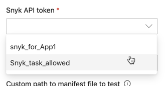

# Bitbucket Pipelines 통합

Snyk은 **Snyk pipe**를 사용하여 Bitbucket Pipeline과 통합되어, CI/CD(지속적 통합/지속적 배포) 워크플로우의 일부로 애플리케이션 종속성 및 Docker 이미지에 대한 오픈 소스 보안 취약점을 원활하게 검색합니다.

사용자는 [Bitbucket Pipes](https://bitbucket.org/blog/meet-bitbucket-pipes-30-ways-to-automate-your-ci-cd-pipeline)를 사용하여 즉시 사용할 수 있는 작업 그룹을 사용하여 비트버킷 파이프라인 CI/CD 워크플로우를 사용자 정의하고 자동화할 수 있습니다.

Snyk pipe를 사용하면 파이프라인에 Snyk 스캔을 신속하게 추가하여 구성에 따라 CI/CD 워크플로우의 여러 지점에서 취약점을 테스트하고 모니터링할 수 있습니다. Bitbucket Pipelines output view에서 결과를 표시하고 Snyk Web UI ([app.snyk.io](http://app.snyk.io))에서도 모니터링할 수 있습니다.

## Bitbucket의 Snyk pipe 정보

빌드 디렉토리에서 Bitbucket Pipeline은 다음 이미지와 유사하게 사용자 정의된 사용 가능한 파이프의 목록을 표시합니다.

이 목록에서 **Snyk**을 찾아 클릭하여 pipe, examples, 파라미터 및 values을 확인합니다.

## 개발 언어 지원

Bitbucket pipes와의 Snyk 통합은 다음 개발 언어를 지원합니다.

* JavaScript (npm)
* .NET (NuGet)
* PHP Composer
* Ruby
* Docker


Java(Maven and Gradle)를 위한 Bitbucket pipeline 구현에는 [Snyk CLI](https://docs.snyk.io/snyk-cli)가 필요합니다.


## Bitbucket Pipelines 통합: 작동 방식

Snyk pipe를 파이프라인에 추가한 후에는 트리거 유형에 따라 파이프라인이 실행될 때마다 Snyk pipe가 다음 작업을 수행합니다.

### **Scan**

1. Snyk은 앱 종속성 또는 컨테이너 이미지에 취약점 또는 라이센싱 문제가 있는지 검색하고 취약점과 이슈를 나열합니다.
2. Snyk이 취약점을 발견하면(사용자 구성에 따라) 다음 중 하나를 수행합니다.
   * 빌드에 실패합니다
   * 빌드를 완료합니다

### **Monitor**

선택적으로 빌드가 성공적으로 완료되고 Snyk 단계에서 **MONITOR**가 **True**로 설정된 경우 Snyk은 Snyk Web UI에서 프로젝트 종속성의 스냅샷을 저장합니다. 여기서 모든 문제를 표시하는 디펜던시 트리를 보고 기존 앱 버전에서 발견된 새로운 이슈에 대한 알림을 받을 수 있습니다.

## Bitbucket Pipelines 통합 구성

Snyk이 Bitbucket에서 CI/CD 워크플로우의 일부로 코드를 테스트하고 모니터링할 수 있도록 하려면 저장소 루트에 있는 `bitbucket-pipelines.yml` (YAML) 파일에 Snyk pipe를 추가하십시오. 모든 빌드 구성(CI/CD 워크플로우의 파이프라인)을 정의하는 파일입니다.

## 전제 조건

* Bitbucket Pipeline의 경우 지속적인 CI/CD 워크플로우를 활성화하는 데 필요한 빌드 시간이 계정에 있는지 확인합니다.
* Snyk 계정을 생성하고 **Account settings**에서 Snyk API 토큰을 검색합니다.
* Bitbucket에서 Snyk API 토큰에 대한 Repository 변수를 만듭니다. 변수 SNYK\_TOKEN을 호출합니다.

## Snyk pipe 추가 방법

1. 파이프라인을 만들거나 기존 파이프라인을 편집하는 동안 Snyk pipe를 추가합니다. [pipelines](https://confluence.atlassian.com/bitbucket/configure-bitbucket-pipelines-yml-792298910.html) 및 [pipes](https://support.atlassian.com/bitbucket-cloud/docs/pipes/)에 대한 자세한 내용은 비트버킷 설명서를 참조하십시오. Snyk pipe를 추가할 때는 나머지 단계의 지침을 따르십시오.
2. Bitbucket pipeline editor를 사용하여 `.yml` 파일 구성을 업데이트하고 올바른 언어를 선택한 다음 Snyk pipe를 추가할 때 Bitbucket Pipes 빌드 디렉토리를 사용합니다.
3. 모든 빌드 단계 후에 Snyk pipe를 Bitbucket editor 인터페이스에 붙여넣습니다. 빌드 단계는 `npm install / composer install / bundle install / dotnet restore / docker build`와 같은 명령어입니다.
4. **npm publish** 또는 **docker push**와 같은 배포 단계 **이전**에 pipe를 붙여넣어야 합니다.
5. **LANGUAGE**를 구성하고 **DONT\_BREAK\_BUILD**에서 발견된 취약점에 대한 파이프라인 실패 여부를 선택하고(**SEVERITY\_THRESHOLD**를 사용할 수도 있음), **MONITOR**를 사용하도록 설정합니다. 자세한 내용은 이 문서의 다음 섹션인 Snyk pipe 파라미터 및 values를 참조하십시오.
6. 파이프라인 명령에 Snyk이 포함되면 해당 저장소(`package.json`, `package-lock.json`)에서 매니페스트 파일을 찾고 검색을 수행합니다.

결과는 다음과 같이 Bitbucket Pipelines output 인터페이스에 나타납니다.


**Note:** 빌드가 실패하면 **MONITOR**가 **True**로 설정된 경우에도 Snyk은 빌드가 성공할 때까지 프로젝트가 배포되지 않으므로 monitor 단계로 계속 진행되지 않습니다. Snyk.io에서 취약점이 있는 프로젝트를 모니터링하려면 **DONT\_BREAK\_BUILD**를 **True**로 설정합니다. **SEVERITY\_THRESHOLD**를 사용하여 scanning 단계에서 pipe의 실패에 대한 심각도 임계값을 pipe에 알릴 수 있습니다. 자세한 내용은 다음 섹션인 Snyk pipe 파라미터 및 values를 참조하십시오.


## Snyk pipe 파라미터 및 values (Bitbucket Cloud)

다음은 CI/CD 워크플로의 일부로 취약점 검색을 포함하려면 파이프라인 YAML 파일의 일부로 구성해야 하는 Snyk pipe입니다.

`- pipe: snyk/snyk-scan:0.4.6`

변수:

SNYK\_TOKEN: '' # 이 값을 암호화하고 $SNYK\_TOKEN 문자열만 파이프라인에 입력하는 것이 좋습니다. 자세한 내용은 다음 표를 참조하십시오.

LANGUAGE: '' # snyk-cli 이미지를 사용하지 않는 경우 필수

\# IMAGE\_NAME: '' # LANGUAGE가 'docker'로 설정된 경우에만 필요

\# CODE\_INSIGHTS\_RESULTS: '' # 선택 사항. 기본값: false

\# SNYK\_TEST\_JSON\_INPUT: "" # 선택 사항. 기본값: false

\# DONT\_BREAK\_BUILD: '' # 선택 사항

\# MONITOR: '' # 선택 사항

\# SEVERITY\_THRESHOLD: '' # 선택 사항

\# ORGANIZATION: '' # 선택 사항

\# PROJECT\_FOLDER: '' # 선택 사항

\# TARGET\_FILE: '' # 선택 사항

\# EXTRA\_ARGS: '' # 선택 사항

\# DEBUG: '' # 선택 사항

다음 표에서는 Snyk pipe 파라미터에 대해 설명합니다.

| **Parameter**           | **Description**                                                                                                                                                                                                                                                                                                                                                                                                                                                                                                                                                                                                                                                                                  |
| ----------------------- | ------------------------------------------------------------------------------------------------------------------------------------------------------------------------------------------------------------------------------------------------------------------------------------------------------------------------------------------------------------------------------------------------------------------------------------------------------------------------------------------------------------------------------------------------------------------------------------------------------------------------------------------------------------------------------------------------ |
| SNYK\_TOKEN (\*)        | 
Snyk 계정 설정에서 검색할 수 있는 Snyk API 토큰을 입력합니다. 토큰을 암호화하는 것이 좋습니다. Bitbucket pipes 디렉토리의 별도 부분에 토큰을 미리 정의된 변수로 추가할 수 있습니다.
<ol><li>빌드 디렉토리에서 새 저장소 값을 추가하고 파라미터 이름을 “SNYK_TOKEN”으로 지정한 다음 Snyk의 API 토큰을 값으로 입력합니다.</li><li>
작성 중인 파이프라인 YAML 파일에서 Snyk pipe의 SNYK_TOKEN 파라미터의 값으로$SNYK_TOKEN를 입력합니다.

</li></ol>
미리 정의된 변수에 대한 자세한 내용은 <a href="https://support.atlassian.com/bitbucket-cloud/resources/">Bitbucket documentation</a>를 참조하십시오.
 |
| LANGUAGE (\*)           | 
앱의 패키지 매니저(npm, maven, rubygems, composer, nuget 또는 docker)를 구성합니다.

가능한 태그의 전체 목록은 <a href="https://hub.docker.com/r/snyk/snyk-cli/tags">Dockerhub</a>를 참조하십시오.
                                                                                                                                                                                                                                                                                                                                                                                                                                                                                                                     |
| IMAGE\_NAME (\*)        | Docker language의 경우에만 docker scan을 수행할 이미지 이름을 구성합니다.                                                                                                                                                                                                                                                                                                                                                                                                                                                                                                                                                                                                                                            |
| CODE\_INSIGHTS\_RESULTS | Snyk test 결과를 사용하여 Code Insight 보고서를 만듭니다. 기본값은 'false'입니다.                                                                                                                                                                                                                                                                                                                                                                                                                                                                                                                                                                                                                                      |
| SNYK\_TEST\_JSON\_INPUT | 이전에 생성된\`snyk test --json\` output에서 Code Insights 보고서만 작성하려는 경우 사용합니다. "Generating the Code Insights report from existing Snyk JSON output"에 이어지는 예를 참조하십시오.                                                                                                                                                                                                                                                                                                                                                                                                                                                                                                                                    |
| DONT\_BREAK\_BUILD      | true로 설정하면 취약점이 검색된 경우에도 빌드를 계속합니다. 기본값은 false입니다. 빌드가 실패합니다.                                                                                                                                                                                                                                                                                                                                                                                                                                                                                                                                                                                                                                    |
| MONITOR                 | 
Snyk UI에 대한 프로젝트의 스냅샷을 기록한 다음 빌드가 실행된 후 프로젝트를 계속 모니터링합니다.

테스트가 성공하면 <a href="http://app.snyk.io">Snyk app</a>에 종속성의 스냅샷을 기록하고 배포된 코드의 상태를 확인하고 모니터링하며 코드에서 새로운 취약점이 발견되면 알림을 받을 수 있습니다.

기본값은 false입니다. 초기 검색 후에는 프로젝트가 모니터링되지 않습니다.
                                                                                                                                                                                                                                                                                                                                                                                                                                           |
| SEVERITY\_THRESHOLD     | 
구성된 수준 이상의 문제를 보고합니다. 가능한 값은 low, med, high, critical입니다.

기본값은 low입니다. 모든 취약점이 보고됩니다.
                                                                                                                                                                                                                                                                                                                                                                                                                                                                                                                                                                                               |
| ORGANIZATION            | 
저장소를 연결할 Snyk 계정에서 조직을 구성합니다.

기본값: none.
                                                                                                                                                                                                                                                                                                                                                                                                                                                                                                                                                                                                                                            |
| PROJECT\_FOLDER         | 
프로젝트가 있는 폴더입니다.

기본값: ..
                                                                                                                                                                                                                                                                                                                                                                                                                                                                                                                                                                                                                                                             |
| TARGET\_FILE            | 
CLI의 --file=과 동일한 패키지 파일(예: <code>package.json</code>).

Docker에 Dockerfile을 값으로 입력합니다.

기본값: none.
                                                                                                                                                                                                                                                                                                                                                                                                                                                                                                                                                                             |
| EXTRA\_ARGS             | 
ESnyk CLI에 전달할 추가 인수입니다. 여기에 설명된 매개 변수와 인수를 사용합니다.

기본값: none.
                                                                                                                                                                                                                                                                                                                                                                                                                                                                                                                                                                                                                       |
| DEBUG                   | 
추가 디버그 정보를 설정합니다.

기본값: false
                                                                                                                                                                                                                                                                                                                                                                                                                                                                                                                                                                                                                                                        |

### **Docker**용 **Snyk pipe** 예제

다음은 Docker 이미지에 대해 설정된 Snyk pipe의 예입니다.

### **npm**용 **Snyk pipe** 예제

다음은 npm에 대해 설정된 Snyk pipe의 예입니다.

