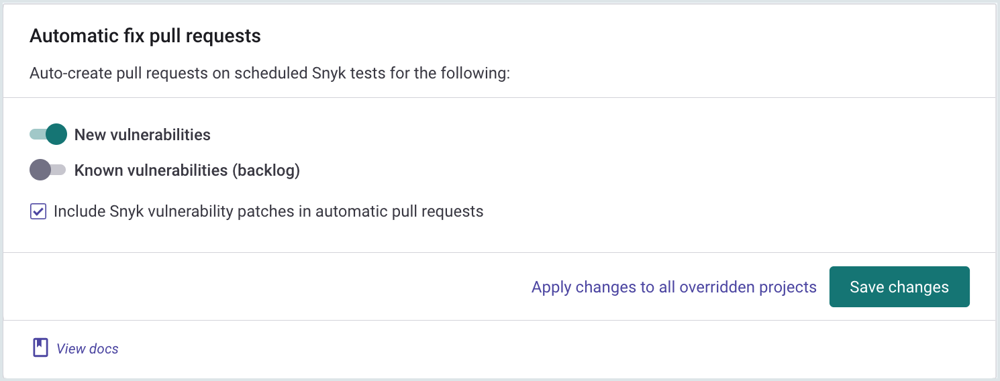

# Bitbucket Cloud 통합

Snyk의 Bitbucket Cloud 통합을 통해 모든 통합 저장소에서 보안 스캔을 지속적으로 수행하고, 오픈 소스 구성 요소의 취약점을 탐지하고, 자동화된 수정 프로그램을 사용할 수 있습니다.

> **기능 사용 여부**\
> 이 기능은 모든 plan에서 사용할 수 있습니다. 자세한 내용은 [pricing plans](https://snyk.io/plans/)를 참고하십시오.

### Bitbucket Cloud 통합 설정

> 새로 생성된 사용자는 Snyk을 사용하여 모니터링해야 하는 모든 저장소에 대한 **Admin** 권한이 있어야 합니다.
>
> 관리자 권한이 필요하지만, Snyk의 액세스는 궁극적으로 [App Password에 할당된 권한](https://support.atlassian.com/bitbucket-cloud/docs/app-passwords/)에 의해 제한됩니다.

1. Snyk에게 Bitbucket 계정에 대한 액세스 권한을 부여하려면 다음과 같이 하십시오.
   1. 관리자 권한이 있는 Bitbucket에서 전용 서비스 계정을 설정합니다.
   2. 사용자 작성에 대한 자세한 내용은 [Bitbucket documentation](https://support.atlassian.com/bitbucket-cloud/docs/grant-access-to-a-workspace/)을 참조하십시오.
2. Snyk에서 **Integrations**페이지로 이동하여 **Bitbucket Cloud** 카드를 클릭합니다.
3.  Bitbucket Cloud 계정에 액세스하여 다음 권한으로 고유한 Snyk용 App Password를 생성하십시오.

    1. **Account: Email & Read**
    2. **Workspace membership: Read**
    3. **Projects: Read**
    4. **Repositories: Read & Write**
    5. **Pull requests: Read & Write**
    6. **Webhooks: Read & Write**

    자세한 방법은 [Bitbucket documentation](https://confluence.atlassian.com/bitbucket/app-passwords-828781300.html)을 참조하십시오.
4. BitBucket의 개인 설정에서 찾을 수 있는 사용자 이름과 사용자가 만든 [서비스 계정의 App Password](https://support.atlassian.com/bitbucket-cloud/docs/app-passwords/)를 입력하십시오.
5.  **Save**를 클릭합니다.\
    Snyk은 Bitbucket Cloud 계정에 연결합니다. 연결에 성공하면 다음 표시가 나타납니다.

    .png>)\
    Snyk이 모니터링할 저장소를 선택할 수 있습니다.
6. Import repositories to Snyk을 시작하려면 **Add your Bitbucket Cloud repositories to Snyk**을 클릭합니다.
7. 메시지가 나타나면 Snyk으로 가져올 저장소를 선택한 다음 **Add selected repositories**를 클릭합니다.
8. Snyk은 전체 디렉토리 트리에서 선택한 저장소에서 디펜던시 파일(package.json 및 pom.xml)을 스캔하고 프로젝트로 가져옵니다.
9. 가져온 프로젝트가 **Projects** 페이지에 나타나고 취약점을 지속적으로 검사합니다.

 (4) (4) (4) (5) (4) (1) (1) (1) (1) (1) (1) (1) (1) (1) (1) (1) (1) (1) (1) (10).png>)

통합이 완료되면 아래에 설명된 대로 기능을 사용할 수 있습니다.

### 프로젝트 수준 보안 보고서

Snyk는 고급 보안 보고서를 생성하여 리포지토리에서 발견된 취약점을 탐색하고 필요한 업그레이드 또는 패치와 함께 리포지토리에 직접 수정 pull request를 열어 즉시 수정할 수 있습니다.

다음은 프로젝트 수준 보안 보고서의 예입니다:

<figure><figcaption></figcaption></figure>

### 프로젝트 모니터링 및 자동 수정 pull requests

Snyk는 매일 또는 매주 프로젝트를 자주 스캔합니다. 새로운 취약점이 발견되면 이메일로 통지하고 리포지토리에 대한 수정 사항이 포함된 자동화된 pull request를 엽니다.

다음은 Snyk에서 열린 수정 pull request의 예입니다:

자동 수정 pull request 설정을 검토하고 조정하려면:

1. settings 클릭 > **Integrations**.
2. Bitbucket Cloud에 대한 **Edit Settings**을 선택합니다.
3. **Automatic fix pull requests으로 이동합니다**:

<figure><figcaption></figcaption></figure>


Bitbucket 인터페이스에서 열리는 수동 pull request와 달리 Snyk pull 요청은 Bitbucket Cloud 또는 Bitbucket Server 계정에 설정된 기본 검토자에게 자동으로 할당되지 않습니다. Snyk 자동 pull request대한 추가 정보.


### Pull request 테스트

Snyk은 리포지토리에서 보안 취약성에 대해 새로 생성된 pull request를 테스트하고 Bitbucket Cloud에 빌드 확인을 보냅니다. pull request로 인해 새로운 보안 문제가 발생하는지 Bitbucket Cloud에서 직접 확인할 수 있습니다.

Bitbucket Cloud의 **Pull Request** 페이지에 Snyk pull request 빌드 확인이 표시되는 방식은 다음과 같습니다:

pull request 테스트 설정을 검토하고 조정하려면:

1. settings  클릭 > **Integrations**.
2. Bitbucket Cloud에 대한 **Edit Settings**을 선택합니다.
3. **Default Snyk test for pull requests > Open Source Security & Licenses**로 이동하여 설정을 편집합니다: \*\*\*\*

<figure><figcaption></figcaption></figure>

### Bitbucket Cloud 통합에 필요한 권한 범위

수동 또는 자동으로 트리거되는 모든 작업은 통합 설정에 구성된 토큰(APP 비밀번호)이 있는 Bitbucket Cloud 서비스 계정에 대해 수행됩니다.

구성된 토큰에 필요한 액세스 범위를 보여줍니다:

| **동작**                                       | **목적**                                                                                      | **Bitbucket에 필요한 권한**                                                                                            |
| -------------------------------------------- | ------------------------------------------------------------------------------------------- | ---------------------------------------------------------------------------------------------------------------- |
| 일일/주간 테스트                                    | 개인 리포지토의 매니페스트 파일 읽기용                                                                       | 리포지토리 읽기                                                                                                         |
| 
수동 수정 pull requests (사용자에 의해 트리거됨)
 | 모니터링되는 리포지토리에서 수정 PR 생성용                                                                    | 
리포지토리(읽기 및 쓰기) <em>pull requests (</em>읽기 및 쓰기<em>)</em>
                                               |
| 자동 수정 및 업그레이드 pull requests                  | 모니터링되는 리포지토리에서 수정/업그레이드 PR 생성용                                                              | 
리포지토리(읽기 및 쓰기) <em>pull requests (</em>읽기 및 쓰기<em>)</em>
                                               |
| pull requests에 대한 Snyk 테스트                   | 새로운 PR이 생성될 때마다 / 기존 PR이 업데이트될 때마다 pull requests 상태 확인을 보내기 위해                              | 
리포지토리(읽기 및 쓰기) <em>pull requests (</em>읽기 및 쓰기<em>)</em>
                                               |
| Snyk로 새 프로젝트 가져오기                            | "Add Projects" 화면(가져오기 팝업)에서 Bitbucket의 사용 가능한 모든 저장소 목록을 표시하기 위해                           | 
<em>계정 (</em>읽기<em>)</em>  <em>Workspace membership (</em>읽기<em>)</em>  <em>프로젝트 (</em>읽기<em>)</em>
 |
| 풀 요청에 대한 Snyk 테스트 - 초기 구성                    | 가져온 리포지토리에 Snyk의 웹훅을 추가하기 위해 pull requests가 생성되거나 업데이트될 때마다 Snyk에 알림이 전송되고 스캔을 트리거할 수 있습니다. | _webhooks (_읽기 및 쓰기_)_                                                                                           |

### 리포지토리에 필요한 권한 범위

Snyk이 모니터링되는 리포지토리에서 필요한 작업(예: 자주 매니페스트 파일 읽기 및 수정 사항 열기 또는 PR 업그레이드)을 수행하려면 통합 Bitbucket Cloud 서비스 계정에 가져온 리포지토리에 대한 **관리자** 권한이 필요합니다.

| **동작**                            | **목적**                                                                                      | **리포지토리에 대한 필수 권한** |
| --------------------------------- | ------------------------------------------------------------------------------------------- | ------------------- |
| 일일/주간 테스트                         | 개인 리포지토의 매니페스트 파일 읽기용                                                                       | **쓰기** 또는 그 이상      |
| pull request에 대한 Snyk 테스트         | 새로운 PR이 생성될 때마다 / 기존 PR이 업데이트될 때마다 pull requests 상태 확인을 보내기 위해                              |                     |
| 수정 및 업그레이드 pull request 열기        | 모니터링되는 리포지토리에서 수정 PR을 생성합니다.                                                                |                     |
| pull request에 대한 Snyk 테스트 - 초기 구성 | 가져온 리포지토리에 Snyk의 웹훅을 추가하기 위해 pull requests가 생성되거나 업데이트될 때마다 Snyk에 알림이 전송되고 스캔을 트리거할 수 있습니다. | **관리자**             |

## 1st Party 통합 (Connect App)

Connect App 통합은 개발자가 Bitbucket 인터페이스에서 Snyk를 사용할 수 있도록 하는 일반 App Password 통합의 상위 계층입니다.

> Connect 앱은 현재 Snyk 오픈 소스 및 Snyk 컨테이너 제품만 지원합니다.

Bitbucket 작업 영역에 Connect 앱을 추가하면 작업 영역 구성원이 저장소를 가져오고 Bitbucket Cloud의 전용 Snyk 탭에서 보안 데이터를 볼 수 있습니다:

### Connect App 설치하기

앱을 설치하려면 Bitbucket Cloud의 작업 영역 리포지토리 중 하나에서 보안 탭으로 이동한 다음 **Try now**를 클릭합니다.

### Connect App 제거

To remove the Connect App from your workspace in Bitbucket Cloud:

1. Navigate to the **workspace settings** page > **Installed apps**.
2. Find **Snyk Security for Bitbucket Cloud** in the installed applications list.
3. Click **remove**.

### Connect App을 다른 Snyk 계정/조직에 연결

The Connect App is associated to a specific Snyk account and organization, as defined during the app onboarding process.

To change these settings later, navigate to the workspace settings and select **Security for Bitbucket Cloud Integration Settings**:

### Bitbucket Cloud 통합 비활성화

To disable this integration:

1. Click on settings > **Integrations** in Snyk.
2. Find the specific integration to deactivate in your list of integrations, and click Edit settings.
3. A page appears showing the current status of your integration and a place to update your credentials, specific to each integration (credentials, API key, Service Principal, or connection details):
4. Click **Disconnect**.

> Your credentials are removed from Snyk and any integration-specific projects Snyk is monitoring are deactivated on Snyk.\
> If you then choose to re-enable this integration at any time, you will need to re-enter your credentials and activate your projects.
