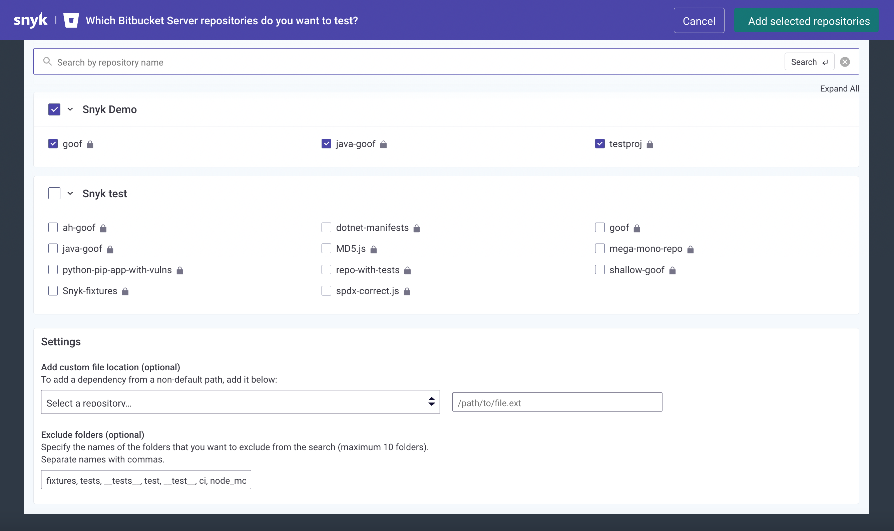
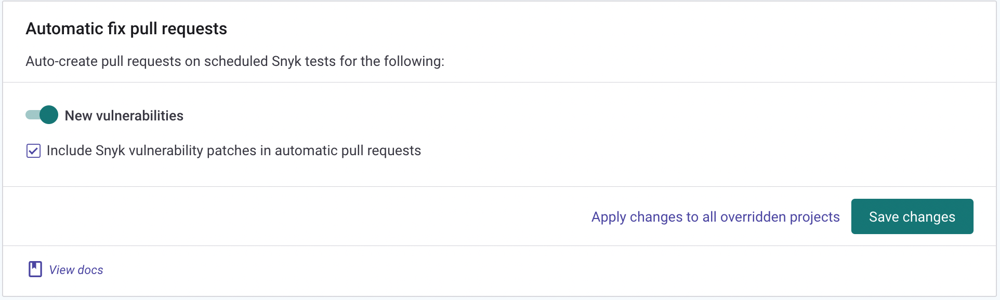

# Bitbucket Data Center/Server 통합

Snyk의 Bitbucket 데이터 센터/서버 통합을 통해 모든 통합 리포지토리에서 지속적으로 보안 검색을 수행하고, 오픈 소스 구성 요소의 취약성을 감지하고, 자동 수정을 사용할 수 있습니다. 이 통합은 Bitbucket Data Center/Server 버전 4.0 이상을 지원합니다.

> **기능 가용성**\
> 이 기능은 엔터프라이즈 플랜에서 사용할 수 있습니다. 자세한 내용은 [pricing plans](https://snyk.io/plans/) 를 참조하세요.

## Bitbucket DC/Server 통합 설정

> **주의**\
> 새로 생성된 사용자에게 Snyk로 모니터링해야 하는 모든 리포지토리에 대한 **관리자** 권한이 있는지 확인하십시오.

1. Snyk에 Bitbucket DC/Server 계정에 대한 액세스 권한을 부여하려면 관리자 권한으로 Bitbucket DC/Server에 전용 서비스 계정을 설정하세요. 사용자 생성에 대한 자세한 내용은 [Bitbucket Server documentation](https://confluence.atlassian.com/bitbucketserver/users-and-groups-776640439.html#Usersandgroups-Creatingauser)를 참조하십시오.
2. Snyk에서 **통합** 페이지로 이동하여 **Bitbucket Server** 카드를 클릭합니다.
3. Bitbucket DC/서버 URL, 생성한 서비스 계정의 사용자 이름 및 비밀번호를 입력합니다. 또는 [personal access token](https://confluence.atlassian.com/bitbucketserver075/personal-access-tokens-1018784848.html)을 만들어 암호 대신 사용할 수 있습니다.
4. **저장**을 클릭합니다. Snyk는 Bitbucket DC/Server 인스턴스에 연결합니다. 연결에 성공하면 다음 표시가 나타납니다.

이제 Snyk이 모니터링할 리포지토리를 선택할 수 있습니다.

1. Add your Bitbucket Server repositories to Snyk을 클릭하여 리포지토리를 Snyk으로 가져오기를 시작합니다.
2. 메시지가 표시되면 Snyk로 가져올 리포지토리를 선택한 다음 **Add selected repositories**를 클릭합니다.
3. Snyk는 전체 디렉토리 트리에서 종속 파일(예: package.json 및 pom.xml)에 대해 선택한 리포지토리를 검색하고 Snyk에 프로젝트로 가져옵니다.
4. 가져온 프로젝트는 프로젝트 페이지에 나타나며 지속적으로 취약점을 확인합니다.

<figure><figcaption></figcaption></figure>

## Bitbucket DC/서버 통합 기능

통합이 완료되면 다음 기능을 사용할 수 있습니다.

## 프로젝트 수준 보안 보고서

Snyk는 고급 보안 보고서를 생성하여 리포지토리에서 발견된 취약점을 탐색하고 필요한 업그레이드 또는 패치와 함께 리포지토리에 직접 수정 풀 요청을 열어 즉시 수정할 수 있습니다.

다음은 프로젝트 수준 보안 보고서의 예입니다:

<figure><figcaption></figcaption></figure>

## 프로젝트 모니터링 및 자동 수정 pull requests

Snyk는 매일 또는 매주 프로젝트를 자주 스캔합니다. 새로운 취약점이 발견되면 이메일과 리포지토리에 대한 수정 사항이 포함된 자동화된 풀 요청을 열어 알림이 전송됩니다.

다음은 Snyk에서 열린 수정 풀 요청의 예입니다.

자동 수정 pull request 설정을 검토하고 조정하려면:

1. settings 클릭 > **Integrations**.&#x20;
2. Bitbucket Server에 대한 **Edit Settings** 선택
3. **Automatic fix pull requests**로 이동합니다:

<figure><figcaption></figcaption></figure>

## **Pull request 테스트**

Snyk tests any newly created pull request in your repositories for security vulnerabilities, and sends a build check to Bitbucket DC/Server. You can to see whether the pull request introduces new security issues, directly from Bitbucket DC/Server.

This is how Snyk pull request build check appears in the **Pull Request** page in Bitbucket DC/Server:

To review and adjust the pull request tests settings:

1. Click on settings > **Integrations**.
2. Select **Edit Settings** for Bitbucket Server.
3. Navigate to **Default Snyk test for pull requests**:

## Bitbucket DC/Server 통합에 필요한 권한 범위

Snyk performs all the operations in Bitbucket DC/Server on behalf of the integrated service account.

For Snyk to perform the required operations on monitored repositories (such as reading manifest files on a frequent basis and opening fix or upgrade PRs), the integrated Bitbucket DC/Server service account needs **Admin** permissions on the imported repositories:

| **Action**                                          | **Why?**                                                                                                                            | **Required permissions on the repository** |
| --------------------------------------------------- | ----------------------------------------------------------------------------------------------------------------------------------- | ------------------------------------------ |
| Daily / weekly tests                                | To read manifest files in private repositories.                                                                                     | **Write** or above                         |
| Snyk tests on pull requests                         | To send pull request status checks when a new PR is created, or an existing PR is updated.                                          |                                            |
| Opening fix and upgrade pull requests               | To create fix PRs in monitored repositories.                                                                                        |                                            |
| Snyk tests on pull requests - initial configuration | To add Snyk's webhooks to the imported repos, so Snyk is informed when pull requests are created or updated, and can trigger scans. | **Admin**                                  |

## Bitbucket DC/서버 통합 비활성화

이 통합을 비활성화하려면:

1. settings 클릭 > **Integrations**.
2. 통합 목록에서 비활성화할 특정 통합을 찾고 Edit settings를 클릭합니다.
3. 통합의 현재 상태와 각 통합(자격 증명, API 키, 서비스 주체 또는 연결 세부 정보)과 관련된 자격 증명을 업데이트할 수 있는 위치를 보여주는 페이지가 나타납니다.
4. 연결 **해제**를 클릭합니다.

> **경고**\
> 귀하의 자격 증명이 Snyk에서 제거되고 Snyk가 모니터링하는 통합 관련 프로젝트는 Snyk에서 비활성화됩니다.
>
> \
> 그런 다음 이 통합을 언제든지 다시 활성화하도록 선택하는 경우 자격 증명을 다시 입력하고 프로젝트를 활성화해야 합니다.
