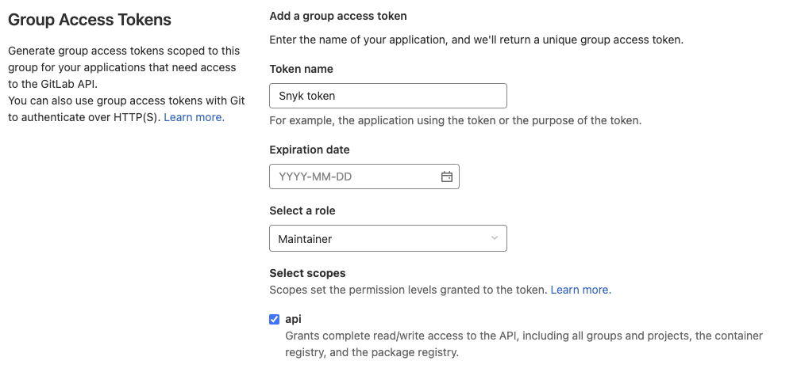

# GitLab 통합

Snyk의 GitLab 통합은 GitLab 버전 9.5 이상(API v4)을 지원합니다.

## 통합 기능

통합을 통해 다음을 수행할 수 있습니다:

1. 취약점을 확인하는 pull request의 Snyk 테스트를 참조하십시오.
2. 저장소에 영향을 미치는 새로운 취약점이 공개될 때 수정 사항이 포함된 이메일 알림 및 Snyk pull request를 받으십시오.
3. 귀하에게 영향을 미치는 취약점에 대해 새로운 업그레이드 또는 패치를 사용할 수 있는 경우 이메일 알림 및 Snyk pull request를 받으십시오.
4. 테스트 보고서 페이지 또는 snyk.io의 저장소에 대한 프로젝트 페이지에서 직접 수정하여 Snyk pull request를 트리거합니다.


**GitLab Wenhooks**는 merge 요청이 발생하면 Snyk에 이벤트를 보냅니다. 그런 다음 이 이벤트는 프로젝트 파일 가져오기, 테스트 프로세스 실행, GitLab에 결과 게시와 같은 일련의 다른 이벤트를 시작합니다. 이 모든 작업은 Snyk 측에서 발생합니다.


## GitLab 통합 설정

이 통합은 공개적으로 연결할 수 있는(사설 네트워크가 아님) GitLab 인스턴스에서만 작동합니다. 사설 네트워크 인스턴스에는 [Snyk Broker](https://docs.snyk.io/features/snyk-broker/set-up-snyk-broker) 환경이 필요합니다.

**단계:**

1. GitLab에서 개인 액세스 토큰을 생성하십시오. **액세스 토큰** 섹션의 사용자 계정 설정 영역에서 이 옵션을 찾을 수 있습니다. 또는 [Group Access Token](https://docs.gitlab.com/ee/user/group/settings/group\_access\_tokens.html)을 사용하여 GitLab의 라이선스 사용자 수에 기여하지 않고 GitLab 그룹 또는 하위 그룹 내의 모든 프로젝트에 대한 액세스 권한을 부여할 수 있습니다.
2. Snyk의 [통합](https://app.snyk.io/login?redirectUri=L2ludGVncmF0aW9ucw%3D%3D\&from=snyk\_auth\_link) 페이지로 이동하여 "Connect to GitLab"을 클릭합니다.
3. 계정 자격 증명과 방금 생성한 토큰을 Snyk의 GitLab 통합 설정 영역에 추가합니다.

## 필요한 권한 및 역할

브로커를 통하거나 직접 Snyk을 GitLab과 통합하는 두 가지 방법이 있습니다. 당사 브로커를 사용하면 조직이 사설 네트워크 내에서 통합할 수 있습니다. 이 문서에서는 직접 통합(브로커가 구현되지 않은 경우)에 필요한 권한에 대해 설명합니다.

Snyk 관리자 또는 조직 구성원으로 GitLab과 통합하려면:

### Personal Access Token이 있는 사용자

1. 액세스를 위한 **API** 범위를 활성화하는 [Personal Access Token](https://gitlab.com/-/profile/personal\_access\_tokens)을 생성합니다.
2. 방금 액세스 토큰을 생성한 GitLab 사용자가 Snyk로 모니터링하려는 프로젝트(저장소)의 **소유자**이거나 해당 프로젝트에 대한 **관리자** 권한이 있는지 확인합니다.

### Group Access Token

1. GitLab에서 그룹을 찾고 **Settings > Access Tokens**을 선택합니다.
2. 설명이 포함된 토큰 이름(예: 'Snyk 토큰')을 입력하고 유지 **관리자** 역할을 선택하고 **API** 범위를 확인합니다.

<figure><figcaption></figcaption></figure>

**관리자 역할이 있는 'api' 범위는 다음을 가능하게 합니다.**

* 사용자 계정을 인증하고  pull request에 대한 수정 pull request 및 Snyk 테스트를 자동화하는 데 필요한 webhook을 생성하기 위한 Snyk
* Snyk 조직 사용자가 수정 풀 요청 생성을 수동으로 트리거할 수 있도록 하는 지속적인 쓰기 액세스
* Snyk이 프로젝트를 모니터링하고 귀하와 조직의 다른 구성원이 테스트를 수동으로 다시 트리거할 수 있도록 하는 지속적인 읽기 액세스.

Snyk 조직의 첫 번째 사용자(Snyk 관리자 계정 사용자)가 GitLab 개인 액세스 토큰 또는 그룹 액세스 토큰과의 통합을 설정하면 토큰이 GitLab에서 인증되어 해당 계정의 저장소에 대한 Snyk 액세스가 가능합니다. 그 후, 해당 Snyk 조직의 모든 사용자는 관련 프로젝트를 추가하고 작업할 수 있지만 merge 요청 자체는 원래 GitLab 사용자(구성을 설정한 Snyk 관리자)가 연 것으로 GitLab에 표시됩니다.

## GitLab에서 Snyk merge 요청으로 취약점 수정

소유한 프로젝트에 대한 Snyk 테스트 보고서를 보거나 Snyk로 보고 있는 프로젝트를 볼 때 취약점을 수정하기 위한 두 가지 옵션이 표시됩니다.

* **수정 Merge Request 열:** g프로젝트에 영향을 미치는 취약점을 수정하는 데 필요한 최소한의 변경으로 Snyk merge 요청 생성.
* **취약점 수정:** 취약점만 수정하는 Snyk merge 요청을 생성합니다.

수정될 취약점을 검토하고, 선택 사항을 변경하고, **Open a fix Merge Request** 페이지에서 merge 요청을 열기 전에 지금 수정할 수 없는 모든 취약점을 무시하도록 선택할 수 있습니다.

snyk.io를 통해 merge 요청을 열면 이러한 경우에 대해 알려드립니다.

다음은 merge 요청의 예입니다:

## 귀하에게 영향을 미치는 새로 공개된 취약점에 대한 Snyk merge 요청 받기

보고 있는 프로젝트에 영향을 미치는 취약점이 공개될 때마다 Snyk은 이에 대해 이메일을 보낼 뿐만 아니라 취약점을 해결하는 Snyk merge 요청도 생성합니다. 위의 예와 유사한 merge 요청을 받게 됩니다.

## 새로운 업그레이드나 패치가 있을 때 Snyk merge 요청 받기

사용 가능한 업그레이드가 없는 경우 취약점을 무시하거나 패치할 수 있습니다(패치는 Node.js 프로젝트에만 사용 가능). 예를 들어 이전에 무시했던 취약점에 대한 업그레이드와 같이 더 나은 수정 옵션을 사용할 수 있게 되면 Snyk은 이메일을 통해 이에 대해 알리고 새 수정으로 merge 요청을 생성합니다.

## GitLab 통합 비활성화


GitLab 통합을 비활성화하면 Snyk 웹 UI에서 Snyk 자격 증명 제거 및 GitLab 프로젝트 비활성화는 물론 모든 Snyk 통합, webhook이 효과적으로 제거됩니다.


프로젝트는 비활성으로 설정되며 더 이상 pull 요청에 대한 경고, pull 요청 또는 Snyk 테스트를 받지 않습니다. 다시 말하지만, 이 저장소에 대한 통합을 가능하게 하는 webhook이 제거됩니다.

언제든지 시청을 다시 시작할 수 있습니다. 그러나 모니터링을 위해 GitLab 프로젝트를 다시 시작하려면 통합을 다시 설정해야 합니다.
