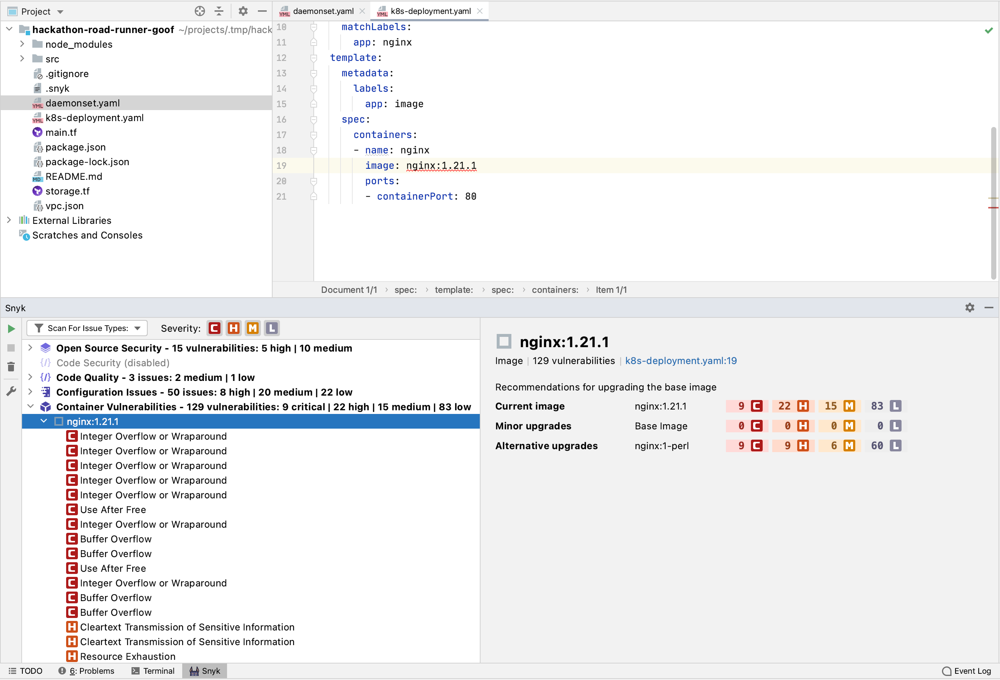

# JetBrains 플러그인

Snyk에는 모든 Snyk 제품을 지원하는 JetBrains IDE용 플러그인이 있습니다: [Snyk Open Source](../../../snyk-products/snyk-open-source/), [Snyk Code](../../../snyk-products/snyk-code/), [Snyk Container](../../../snyk-products/snyk-container/) 및 [Snyk Infrastructure as Code](../../../snyk-products/snyk-infrastructure-as-code/). \
Snyk JetBrains 플러그인은 다음을 포함하여 애플리케이션 보안의 모든 측면을 다룹니다:

* 오픈 소스 종속성의 보안 취약성 (Snyk Open Source).
* 자사 코드의 보안 취약점 및 코드 품질 문제 (Snyk Code).
* Terraform, AWS CloudFormation, Kubernetes 및 Azure Resource Manager와 같은 코드형 인프라의 구성 문제 (ARM) (Snyk IaC)
* Kubernetes 워크로드 파일에서 발견된 컨테이너 이미지의 보안 취약점 (Snyk Container)


Snyk JetBrains 플러그인은 JetBrains 마켓플레이스에 설치할 수 있습니다. [https://plugins.jetbrains.com/plugin/10972-snyk-vulnerability-scanner](https://plugins.jetbrains.com/plugin/10972-snyk-vulnerability-scanner).


## 지원되는 JetBrains IDE

Snyk은 다음 IDE에서 버전 2020.2의 JetBrains 플러그인 버전을 지원합니다:

* Android Studio
* AppCode
* GoLand
* IntelliJ
* PhpStorm
* PyCharm
* Rider
* RubyMine
* WebStorm

## Snyk JetBrains 플러그인 작동 방식

* 플러그인은 Snyk CLI를 기반으로 하지만 CLI만 기반으로 하는 것은 아닙니다. 플러그인은 Snyk 오픈 소스, Snyk IaC 및 Snyk Container용 CLI의 모든 제품 기능을 지원합니다.
* 플러그인은 백그라운드에서 CLI를 자동으로 다운로드합니다. [인증](jetbrains-plugins.md#authentication)하라는 메시지가 표시됩니다.
* Snyk은 [Snyk Code에서 지원하는 모든 언어를 지원](../../../snyk-products/snyk-code/snyk-code-language-and-framework-support.md)합니다. 모든 IDE(예: RubyMine)에 플러그인을 설치할 수 있습니다. 플러그인이 설치되면 Snyk는 찾은 모든 언어 파일을 분석합니다.
* CLI가 이미 머신에 설치된 경우 플러그인은 제공된 토큰을 사용합니다. 그렇지 않으면 플러그인 인[증 메커니즘](jetbrains-plugins.md#authentication)을 통해 인증 토큰을 제공해야 합니다.

## 플러그인 설치

IDE 플러그인 라이브러리를 사용하여 설치:

1. IDE에서 **Preferences** 창을 엽니다.
2. **Plugins** 탭으로 이동합니다.
3. **Plugins** 탭에서 **Snyk**을 검색합니다.
4. **Snyk vulnerability scanning** 플러그인을 선택하십시오.
5. **Install** 버튼을 클릭합니다.
6. 설치가 완료되면 IDE를 다시 시작합니다.

<figure><figcaption>
Snyk 취약점 스캐닝 플러그인 선택
</figcaption></figure>

## 구성

### 환경

프로젝트를 분석하기 위해 플러그인은 분석하는 프로젝트 유형에 따라 다음 환경 변수가 필요한 Snyk CLI를 사용합니다.

* `PATH`: 필요한 바이너리의 경로(예: maven)
* `JAVA_HOME`: Java 의존성을 분석하는 데 사용할 JDK의 경로

명령줄에서 JetBrains IDE를 시작하지 않거나 셸 환경을 사용하여 시작하는 스크립트 파일을 생성하지 않는 경우 셸 환경에서만 이러한 변수를 설정하는 것(예: `~/.bashrc` 사용)으로는 충분하지 않습니다.

* **Windows**에서는 GUI를 사용하거나 setx 도구를 사용하여 명령줄에서 변수를 설정할 수 있습니다.
* macOS에서 Finder에서 직접 IDE를 시작하려면 launchd 프로세스가 환경 변수를 알아야 합니다. **launchctl setenv** 명령을 실행하여 Finder를 사용하여 시작한 응용 프로그램에 대한 환경 변수를 설정합니다. 이 시작을 수행하거나 사용자 로그인 시 실행하는 스크립트를 사용하여 수행할 수 있습니다.\
  **Note:** macOS UI에 환경 변수를 제공하는 것은 운영 체제 릴리스 간에 변경될 수 있으므로 `~/.bashrc`를 사용하여 정의할 수 있는 셸 환경을 활용하기 위해 IDE를 시작하는 작은 셸 스크립트를 만드는 것이 더 쉬울 수 있습니다.
* **Linux**에서는 `/etc/environment` 파일을 업데이트하여 환경 변수를 Windows 관리자 및 UI로 전파할 수 있습니다.

### 프록시

프록시 서버를 사용하여 인터넷에 연결해야 하는 경우  [Jetbrains IDE settings](https://www.jetbrains.com/help/idea/settings-http-proxy.html)을 사용하여 구성하세요. Snyk 플러그인이 이를 사용합니다.

## 인증

CLI가 처음 필요할 때 플러그인이 백그라운드에서 자동으로 다운로드합니다. 플러그인이 설치된 후 인증하는 몇 가지 방법이 있습니다.

플러그인이 설치된 후 IDE 플러그인을 인증하고 Snyk에 연결하라는 메시지가 표시됩니다.

<figure><figcaption>
코드를 인증하고 테스트를 시작하라는 메시지를 표시합니다.
</figcaption></figure>

**Test code now**를 클릭합니다. 플러그인은 Snyk Web UI에 대해 시스템을 인증하는 Snyk CLI에 의존합니다.

Snyk에서 메시지가 표시되면 **Authenticate**를 클릭합니다.

인증이 완료되면 확인 메시지가 나타납니다.

IDE는 로컬 시스템에서 인증을 읽고 저장합니다.

이제 브라우저 창을 닫고 IDE로 돌아갈 수 있습니다.

분석이 자동으로 시작됩니다:

<figure><figcaption>
JetBrains 플러그인으로 분석
</figcaption></figure>

### 수동으로 토큰 추가

1. 여기서 토큰 생성: [https://app.snyk.io/account](https://app.snyk.io/account)
2. **\[JetBrains IDE] >> Preferences >> Tools >> Snyk**
3. **Connect IDE to Snyk**아래에 토큰을 붙여넣거나 입력합니다.
4. **Apply** 또는 **OK**를 클릭합니다.

### 수동 인증

토큰을 추가하거나 자동으로 인증할 수 없는 경우 명령줄에서 snyk auth를 실행하고 이전 단계에 따라 프롬프트에 응답합니다. 도움이 필요하면 [Snyk support](https://snyk.zendesk.com/agent/dashboard)에 요청을 제출하십시오.

## 분석 실행


분석을 실행하기 전에 프로젝트 파일(예: requirements.txt)이 저장되어 있는지 확인하십시오.


일일 코딩 워크플로 중에 분석을 트리거하려면 실행(재생) 버튼 또는 **Run scan**을 클릭합니다.

## 분석 결과: Snyk Open Source

Snyk 오픈 소스 분석은 매니페스트 파일에서 발견된 취약점 및 라이선스 문제 목록을 보여줍니다. 더 자세한 정보를 보려면 취약성 또는 라이선스 문제를 선택하십시오:

## 분석 결과: Snyk Code

Snyk Code 분석은 애플리케이션 코드에서 발견된 보안 취약점 및 코드 문제 목록을 보여줍니다. 다른 사람들이 문제를 해결한 방법에 대한 자세한 내용과 수정 사항의 예를 보려면 보안 취약성 또는 코드 보안 문제를 선택하십시오.

## 분석 결과: Snyk 구

Snyk 구성 분석은 스캔할 때마다 Terraform, Kubernetes, AWS CloudFormation 및 Azure Resource Manager(ARM) 코드의 문제를 보여줍니다. Snyk CLI를 기반으로 하는 스캔은 로컬 개발에 빠르고 친숙합니다. 더 자세한 정보를 보려면 문제를 선택하십시오.

<figure><figcaption>
Snyk 구성 분석에 대한 추가 정보 표시
</figcaption></figure>

Snyk 플러그인은 기본 문제를 빠르게 이해하고 수정할 수 있도록 정보를 제공합니다:

* **Description:** 잘못된 구성이 무엇인지
* **Impact:** 잘못된 구성이 잠재적으로 악용될 수 있는 방법
* **Path:** 문제가 발생하는 트리의 경로
* **Remediation:** 문제를 해결하는 방법
* **References:** 다양한 출처에서 더 깊이 조사할 수 있는 곳
* **Ignore:** 해당되는 경우 문제를 무시하는 버튼

## 분석 결과: Snyk Container

플러그인은 Kubernetes 구성 파일을 스캔하고 컨테이너 이미지를 검색합니다. 추출된 컨테이너 이미지와 [Snyk Intel Vulnerability Database](https://security.snyk.io)의 최신 정보와 비교 분석하여 취약점을 빠르게 찾아냅니다.

Snyk 컨테이너 분석은 이미지가 취약할 수 있는 각 보안 취약성을 보여줍니다. 자세한 정보를 보려면 취약점을 선택하십시오.

위험 또는 높음과 같은 다양한 심각도 수준과 함께 비교 테이블이 표시됩니다. 이것은 현재 이미지와 Snyk에서 권장하는 이미지 간의 취약점 차이를 보여주며, 동일한 특성을 심각도별로 정렬합니다. 이렇게 하면 이미지를 권장 이미지로 업그레이드할지 결정하고 프로덕션에서 실행 중인 이미지의 신뢰도를 높일 수 있습니다.

<figure><figcaption>
Snyk 컨테이너 분석에 대한 추가 정보 표시
</figcaption></figure>

## Snyk 컨테이너 및 Kubernetes 통합 작동 방식

플러그인은 Kubernetes 워크로드 파일을 스캔하고 사용된 이미지를 수집합니다. 플러그인이 컨테이너 이미지를 올바르게 스캔하는지 문제를 해결하려면 다음을 확인할 수 있습니다:

* 이미지 정의가 프로젝트의 Kubernetes YAML 파일에 있는지 여부입니다. YAML 이미지 키에 대해 YAML 값으로 지정된 이미지가 있는지 확인하십시오.
* 컨테이너 이미지가 로컬로 성공적으로 빌드되었는지 및/또는 컨테이너 레지스트리에 푸시되었는지 여부입니다. Kubernetes YAML 파일의 컨테이너 이미지를 참조하기 전에 이를 확인하는 것도 좋은 방법입니다.

오류가 발생하면 [contact support](https://snyk.zendesk.com/agent/dashboard)에 문의하세요.

For each image found, perform a test with the Snyk CLI.

* Refer to the [doc](https://docs.snyk.io/products/snyk-container/snyk-cli-for-container-security#testing-an-image) for more information about how Snyk Container performs a test on the image.
* While testing the image the CLI downloads the image if it is not already available locally in your Docker daemon.
* Snyk plans to expand the scope of Container scanning, so if there are more files (like Dockerfiles) or workflows that you want to be supported, submit a feature request [to Snyk support](https://support.snyk.io/hc/en-us/requests/new).

## Filter results

### Filter by severity

Snyk reports critical, high, medium and low severities. You can filter for the severity level you need by selecting the value from the dropdown as shown in the screenshot that follows. By default all levels are selected. You must select at least one.

### Filter by issue type

Snyk reports the following types of issues:

* **Open Source Vulnerabilities**: found in open source dependencies
* **Security Vulnerabilities**: found in your application’s source code
* **Quality Issues**: found in your application source code
* **Configuration Issues**: found in infrastructure as code files
* **Container Vulnerabilities**: found in images sourced from Kubernetes workload files

You can filter for each one of them by selecting the value from the dropdown as shown in the screenshot that follows. By default all three issue types shown are selected.

## Plugin configuration

After the plugin is installed, you can set the following configurations for the plugin, using **Preferences → Tools → Snyk**:

* **Token**: the token that should be used for authentication with Snyk (can be generated through the Account Settings in the Snyk Web UI)
* **Custom endpoint**: custom endpoint for the Snyk Web UI, if needed
* **Ignore unknown CA**: for ignoring the SSL cert, if needed
* **Organization**: the org to run Snyk test against (similar to the `--org=` option in the CLI).
* **Additional parameters**: additional CLI snyk test options you want to use for the test
* **Snyk Open Source vulnerabilities**: analyze the project for open source vulnerabilities through the CLI using Snyk Open Source; enabled by default
* **Snyk Infrastructure as Code issues**: analyze the project for insecure configurations in Terraform and Kubernetes code; enabled by default
* **Snyk Container vulnerabilities**: analyze the project for container vulnerabilities in container images and Kubernetes applications; enabled by default
* **Snyk Code Security issues**: analyze the project for security vulnerabilities in your application code using Snyk Code; enabled by default
* **Snyk Code Quality issues**: analyze the project for quality issues in your application code using Snyk Code; disabled by default

#### Organization setting

This setting allows you to specify an organization slug name to run tests for that organization. The value must match the URL slug as displayed in the URL of your org in the Snyk UI: `https://app.snyk.io/org/[orgslugname]`.

If not specified, preferred organization as defined in your [web account settings](https://app.snyk.io/account) is used to run tests.

### Support and contact information


Need more help? [Contact Snyk support](https://support.snyk.io/hc/en-us/requests/new).


**Share your experience.**

Snyk continuously strives to improve the plugins experience. Would you like to share with us your feedback about the Snyk JetBrains Plugin? [Schedule a meeting](https://calendly.com/snyk-georgi/45min?month=2022-01).
