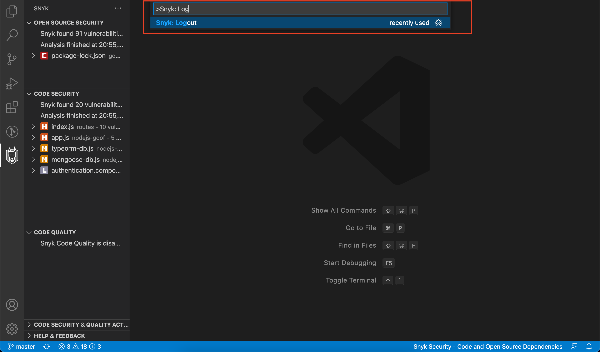

# Visual Studio Code 확장


Snyk Visual Studio Code 확장은 마켓플레이스에 설치할 수 있습니다: [https://marketplace.visualstudio.com/items?itemName=snyk-security.snyk-vulnerability-scanner](https://marketplace.visualstudio.com/items?itemName=snyk-security.snyk-vulnerability-scanner)

Visual Studio Code 확장에는 Snyk CLI가 필요합니다. [Install the Snyk CLI](../../../snyk-cli/install-the-snyk-cli/)를 참조하십시오. .


## 지원되는 언어, 패키지 관리자 및 프레임워크

* Snyk Open Source의 경우 VS Code 확장은 Snyk Open Source 및 CLI에서 지원하는 모든 언어 및 패키지 관리자를 지원합니다. 전체 [목록](../../../snyk-products/snyk-open-source/language-and-package-manager-support/)을 참조하십시오.
* Snyk Code의 경우 VS Code 확장은 [Snyk Code에서 지원하는 모든 언어와 프레임워크](../../../snyk-products/snyk-code/snyk-code-language-and-framework-support.md)를 지원합니다.

## 확장 프로그램 설치

[Visual Studio Code Marketplace](https://marketplace.visualstudio.com/items?itemName=snyk-security.snyk-vulnerability-scanner)에서 Snyk 확장을 찾을 수 있습니다. 설치하려면 다음 중 하나를 수행하십시오:

* [Visual Studio Code Marketplace에서 Snyk 확장](https://marketplace.visualstudio.com/items?itemName=snyk-security.snyk-vulnerability-scanner)으로 이동하고 Snyk 확장에 대한 지침을 따릅니다. VS Code의 문서는 Visual Studio Code에서 설치 프로세스를 트리거하고 설치 단계를 안내하는 데 도움이 됩니다.
* Browse for the extension as advised [Visual Studio code site](https://code.visualstudio.com/docs/editor/extension-gallery#\_browse-for-extensions) and search for Snyk, then install (as explained in the [installation instructions](https://code.visualstudio.com/docs/editor/extension-gallery#\_install-an-extension).
* 권장되는 [Visual Studio 코드 사이트](https://code.visualstudio.com/docs/editor/extension-gallery#\_browse-for-extensions)에 따라 확장을 찾아 Snyk을 검색한 다음 설치합니다([설치 지침](https://code.visualstudio.com/docs/editor/extension-gallery#\_install-an-extension)에 설명된 대로).

확장 프로그램이 설치되면 사이드바에서 Snyk 아이콘을 찾을 수 있습니다.

Snyk 확장은 수정 또는 조치 방법을 결정하는 데 필요한 정보가 포함된 간결하고 깔끔한 보기로 모든 제안을 제공합니다.

%20\(1\)%20\(1\)%20\(1\)%20\(1\)%20\(1\)%20\(1\)%20\(1\)%20\(1\)%20\(1\)%20\(1\)%20\(1\)%20\(1\)%20\(1\)%20\(1\)%20\(1\)%20\(1\)%20\(1\)%20\(1\)%20\(1\)%20\(1\)%20\(1\)%20\(1\).png)

## 구성

### Environment

프로젝트를 분석하기 위해 플러그인은 환경 변수가 필요한 Snyk CLI를 사용합니다:

* `PATH`: 필요한 바이너리의 경로(예: maven)
* `JAVA_HOME`: Java 종속성을 분석하는 데 사용하려는 JDK의 경로

명령줄에서 IDE를 시작하지 않거나 셸 환경을 사용하여 IDE를 시작하는 스크립트 파일을 생성하지 않는 경우 셸 환경에서만 이러한 변수를 설정하는 것(예: `~/.bashrc` 사용)으로는 충분하지 않습니다.

* `Windows`에서는 GUI를 사용하거나 `setx` 도구를 사용하여 명령줄에서 변수를 설정할 수 있습니다.
* `macOS`에서 `launchd` 프로세스는 Finder에서 직접 IDE를 시작하기 위해 환경 변수를 알아야 합니다. 예를 들어 시작 시 또는 사용자 로그인 시 실행하는 스크립트를 통해 `launchctl setenv` 명령을 사용하여 Finder를 사용하여 시작한 응용 프로그램에 대한 환경 변수를 설정할 수 있습니다.\
  **Note:** macOS UI에 환경 변수를 제공하는 것은 운영 체제 릴리스 간에 변경될 수 있으므로 `~/.bashrc`를 통해 정의할 수 있는 셸 환경을 활용하기 위해 IDE를 시작하는 작은 셸 스크립트를 만드는 것이 더 쉬울 수 있습니다.
* `Linux`에서 /etc/environment 파일을 업데이트하면 환경 변수가 Windows 관리자 및 UI로 전파될 수 있습니다.

### 프록시

프록시 뒤에 있는 경우 프록시 설정은 VS Code 프록시 설정을 사용하여 구성되거나 `http_proxy` 및 `https_proxy` 환경 변수를 사용하여 설정됩니다.

## 인증

확장 프로그램은 인증을 위해 Snyk API 토큰을 사용합니다. 토큰을 안전하게 저장하기 위해 시스템의 키체인을 사용하여 토큰을 관리하는 [Secret Storage API](https://code.visualstudio.com/api/references/vscode-api#SecretStorage)를 사용합니다.

### 로그인

인증하려면 다음 단계를 따르세요:

1.  확장 프로그램이 설치되면 왼쪽 탐색 모음에서 Snyk 아이콘을 클릭합니다: (1) (1) (1).png>)

2.  **Connect VS Code with Snyk**을 클릭합니다. 확장 프로그램은 Snyk 인증 API에 의존하며 Snyk 웹 애플리케이션에 대해 컴퓨터를 인증하도록 요청합니다.\
     (1) (1).png>)

3. **Authenticate**를 클릭합니다.
4.  인증 성공 후 확인 메시지를 확인하세요.\
    

5. 브라우저 창을 닫고 VS Code로 돌아갑니다. VS Code는 이제 로컬 컴퓨터에서 인증을 읽고 저장합니다.

### 계정 전환

다른 계정으로 재인증하려면 다음 단계를 따르세요:

1. 제공된 `Snyk: Log Out` 명령을 실행합니다.
2. 로그아웃한 후 **Connect VS Code with Snyk**를 클릭하여 다른 계정으로 인증합니다.

또는 `Snyk: Set Token` 명령을 실행하고 텍스트 필드에 수동으로 토큰을 설정합니다.

 (1).png>)

## 분석 실행

IDE에서 확장 프로그램은 이미 파일을 선택하고 분석을 위해 업로드하고 있습니다.

Snyk Open Source에는 Snyk CLI가 필요하므로 백그라운드에서 다운로드됩니다.

Snyk Code 분석은 CLI 없이 빠르게 실행되므로 결과가 이미 제공될 수 있습니다. 그렇지 않으면 Snyk이 작업 공간에서 취약점을 검색하는 동안 다음 화면이 표시됩니다:

 (1) (1) (1).png>)

폴더나 작업 공간을 열면 Snyk 분석이 자동으로 실행됩니다.

* Snyk Code는 파일 저장 시 자동으로 스캔을 수행합니다.
* Snyk Open Source는 기본적으로 저장 시 자동으로 실행되지 않지만 설정에서 활성화할 수 있습니다:

 (1) (1).png>)

**Tip**: 작업하는 동안 수동으로 저장하고 싶지 않다면 [AutoSave](https://code.visualstudio.com/docs/editor/codebasics#\_save-auto-save)를 활성화하십시오.

## 다시 스캔

수동으로 스캔을 시작하려면 저장하거나 다시 스캔 아이콘을 사용하여 수동으로 다시 스캔하십시오:

 (1) (1) (1).png>)

결과의 코드 품질, 코드 보안 또는 오픈 소스 보안 부분만 필요한 경우 보고 싶지 않은 결과가 포함된 기능을 쉽게 비활성화하거나 보기를 축소할 수 있습니다:

## Snyk Code 고급 모드

Snyk Code에는 스캔 수행 방법을 제어할 수 있는 "고급" 모드가 있습니다.

수동으로 분석을 수행하려면 확장 구성에서 스캔 프로세스를 제어할 수 있는 고급 모드를 활성화할 수 있습니다.

## 분석 결과 보기

Snyk 분석은 애플리케이션 코드에서 발견된 보안 취약점 및 코드 Issue 목록을 보여줍니다. 다른 사람들이 Issue를 해결한 방법에 대한 자세한 내용과 예를 보려면 보안 취약성 또는 코드 보안 Issue를 선택하세요. 선택한 Issue에 대한 Snyk 제안 정보가 오른쪽 패널에 나타납니다.

 (1) (1) (1) (1).png>)

### Snyk 분석 패널

앞의 코드 화면 왼쪽에 있는 Snyk 분석 패널은 분석에 소요된 시간과 그에 대한 제안이 있는 문제 목록을 보여줍니다.

아이콘의 의미는 다음과 같습니다:

|  (2).png>) Critical severity | 공격자가 민감한 데이터에 액세스하고 애플리케이션에서 코드를 실행하도록 허용할 수 있습니다.                             |
| -------------------------------------------------------------------- | ------------------------------------------------------------------------------ |
|  (2) (1).png>) High severity | 공격자가 애플리케이션의 민감한 데이터에 액세스하도록 허용할 수 있습니다.                                       |
|  (2).png>) Medium severity   | 일부 조건에서 공격자가 애플리케이션의 민감한 데이터에 액세스하도록 허용할 수 있습니다.                               |
|  (2).png>) Low severity      | 응용 프로그램은 응용 프로그램을 공격하기 위해 다른 취약성과 함께 사용할 수 있는 취약성 매핑을 허용하는 일부 데이터를 노출할 수 있습니다. |

`snyk.severity` 설정을 사용하여 보고 싶은 심각도를 설정하여 문제를 필터링할 수 있습니다. 예를 들어 `"snyk.severity": { "critical": true, "high": true, "medium": true, "low": false }`로 설정하여 심각도가 낮은 문제를 숨깁니다. 설정 UI에서 설정을 적용할 수도 있습니다.

 (2).png>)

### Snyk Code 편집기 창

결과 화면 중간에 있는 편집기 창에는 검사한 코드가 표시됩니다. 이렇게 하면 Snyk 문제를 검사할 때 항상 문제와 가까운 코드 컨텍스트를 갖게 됩니다.

### Snyk Code 취약점 창

 (1) (1) (1) (1) (1).png>)

결과 화면 오른쪽에 있는 Snyk 제안 패널은 예를 들어 코드의 변수 이름과 빨간색 줄 번호를 사용하여 Snyk 엔진의 인수를 보여줍니다. 다음을 볼 수도 있습니다:

* 버그 패턴을 더 자세히 설명하기 위한 외부 리소스 링크(**추가 정보** 링크).
* **Security**(발견된 문제는 보안 문제임), **Database**(문제는 데이터베이스 상호 작용과 관련됨) 또는 **In Test**(문제는 테스트 코드 내에 있음)와 같이 Snyk에서 할당한 태그입니다.
* 다른 사람들이 문제를 해결한 방법을 확인하는 데 도움이 될 수 있는 오픈 소스 리포지토리의 코드.
* Snyk가 이 특정 제안 또는 전체 파일에 대한 이러한 제안 모두를 무시하도록 하는 무시 주석을 추가하는 데 사용할 수 있는 패널 하단의 두 개의 버튼. .

Snyk에는 다른 사람들이 같은 문제를 보지 않도록 오탐지를 보고하는 피드백 메커니즘도 포함되어 있습니다.

### Snyk Open Source 편집기 창

편집기 창은 JavaScript, TypeScript 및 HTML로 코딩하는 동안 오픈 소스 모듈의 보안 취약성을 보여줍니다. 가져오는 모듈에 포함된 취약점의 수와 같은 피드백을 코드와 함께 인라인으로 받으십시오. 편집기는 최상위 종속성 취약점만 노출합니다. 전체 취약점 목록은 측면 패널을 참조하십시오.

가져오는 npm 패키지에서 보안 취약점을 찾을 수 있으며 필요한 즉시 가져온 npm 패키지에서 알려진 취약점의 수를 확인할 수 있습니다:

코드 인라인 취약점 수는 `package.json` 파일에도 표시됩니다.

.png>)

잘 알려진 CDN에서 JavaScript 패키지의 보안 취약점을 찾으십시오. 확장 프로그램은 프로젝트의 HTML 파일을 스캔하고 즐겨찾는 CDN에서 포함된 모듈에 대한 취약성 정보를 표시합니다.

* 현재 지원되는 CDN은:
  * unpkg.com
  * ajax.googleapis.com
  * cdn.jsdelivr.net
  * cdnjs.cloudflare.com
  * code.jquery.com
  * maxcdn.bootstrapcdn.com
  * yastatic.net
  * ajax.aspnetcdn.com

.png>)

제공된 코드 작업을 트리거하여 가장 심각한 취약점으로 이동할 수 있습니다. 자세한 내용을 표시하는 취약점 창이 열립니다.

 (1).png>)

### Snyk Open Source 취약점 창

OSS(Open Source Security) 취약점 창은 취약한 모듈에 대한 정보를 보여줍니다.

* Links to external resources (CVE, CWE, Snyk Vulnerability DB) to explain the vulnerability in more detail.
* Displays CVSS score and exploit maturity.
* Provides detailed path on how vulnerability is introduced to the system.
* Shows summary of the vulnerability together with the remediation advice to fix it.

## 확장 구성

확장이 설치된 후 확장에 대해 다음 구성을 설정할 수 있습니다:

* **특징**
  * **Code Security**: 코드 보안 분석이 코드에 대해 실행되어야 하는지 구성합니다.
  * **Code Quality**: 코드 품질 분석이 코드에 대해 실행되어야 하는지 구성합니다.
  * **Open Source Security**: 오픈 소스 종속성에 대해 보안 분석을 실행해야 하는지 여부를 구성합니다.
* **Severity**: 분석 결과 트리에 표시할 심각도 수준을 설정합니다.
* **고급**
  * **Advanced mode**: 분석을 실행해야 하는 시기를 사용자가 수동으로 제어할 수 있도록 패널을 토글합니다.
  * **Auto Scan Open Source Security**: 분석 결과 트리에 표시할 심각도 수준을 설정합니다.
  * **Additional Parameters**: 오픈 소스 보안 테스트를 위해 Snyk CLI에 전달할 매개변수를 설정합니다. 전체 목록을 보려면 이 [참조](../../snyk-cli/cli-reference.md)를 참조하십시오.
  * **Organization**: 해당 조직에 대한 테스트를 실행할 조직 슬러그 이름을 지정합니다.

### 조직 설정

조직 설정 `snyk.advanced.organization`의 값은 Snyk UI의 조직 URL(`https://app.snyk.io/org/[orgslugname]`)에 표시된 URL 슬러그와 일치해야 합니다.

지정하지 않으면 [web account settings](https://app.snyk.io/account)에 정의된 기본 조직이 테스트를 실행하는 데 사용됩니다.

## .dcignore 파일 만들기

특정 파일 및 디렉터리(예: **node\_modules**)를 무시하려면 **.dcignore** 파일을 만듭니다. 프로젝트가 있는 디렉토리에서 시작하여 모든 레벨의 모든 디렉토리에 생성할 수 있습니다. 파일 구문은 `.gitignore`와 동일합니다.

* Snyk는 `.gitignore` 파일이 없을 때 파일을 추가할 것을 권장합니다. 파일을 추가하면 업로드해야 하는 파일이 크게 줄어들고 분석 속도가 빨라집니다.
* 기본 **`.dcignore`** 파일을 빠르게 추가하려면 VS Code 및 Snyk 확장 Snyk에서 제공하는 명령을 사용하여 **`.dcignore`** 파일을 생성하고 새로 생성된 **`.dcignore`** 파일을 저장합니다.

## 지원 및 연락처 정보


도움이 더 필요하세요? [Snyk support](https://support.snyk.io/hc/en-us/requests/new)에 요청을 제출하십시오.


**Share your experience.**

Snyk는 Snyk 플러그인 경험을 개선하기 위해 지속적으로 노력하고 있습니다. Snyk Visual Studio Code 확장에 대한 피드백을 공유하시겠습니까? [미팅 잡기](https://calendly.com/snyk-georgi/45min?month=2022-01).
