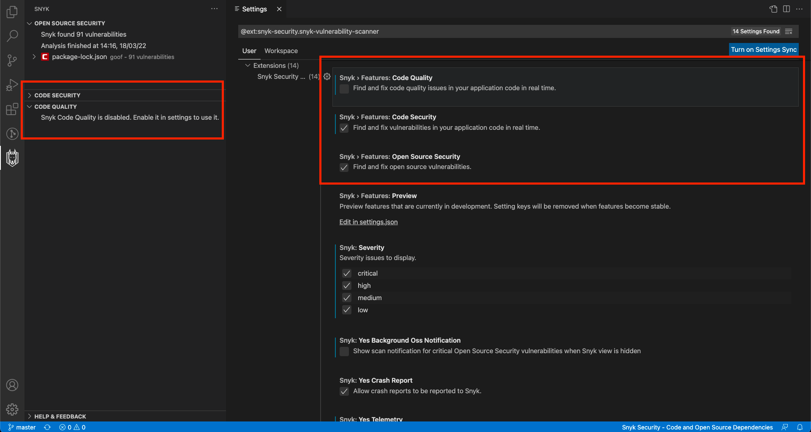

# Visual Studio Code 확장


Snyk Visual Studio Code 확장은 마켓플레이스에 설치할 수 있습니다: [https://marketplace.visualstudio.com/items?itemName=snyk-security.snyk-vulnerability-scanner](https://marketplace.visualstudio.com/items?itemName=snyk-security.snyk-vulnerability-scanner)

Visual Studio Code 확장에는 Snyk CLI가 필요합니다. [Install the Snyk CLI](../../../snyk-cli/install-the-snyk-cli/)를 참조하십시오. .


## 지원되는 언어, 패키지 관리자 및 프레임워크

* Snyk Open Source의 경우 VS Code 확장은 Snyk Open Source 및 CLI에서 지원하는 모든 언어 및 패키지 관리자를 지원합니다. 전체 [목록](../../../snyk-products/snyk-open-source/language-and-package-manager-support/)을 참조하십시오.
* Snyk Code의 경우 VS Code 확장은 [Snyk Code에서 지원하는 모든 언어와 프레임워크](../../../snyk-products/snyk-code/snyk-code-language-and-framework-support.md)를 지원합니다.

## 확장 프로그램 설치

[Visual Studio Code Marketplace](https://marketplace.visualstudio.com/items?itemName=snyk-security.snyk-vulnerability-scanner)에서 Snyk 확장을 찾을 수 있습니다. 설치하려면 다음 중 하나를 수행하십시오:

* [Visual Studio Code Marketplace에서 Snyk 확장](https://marketplace.visualstudio.com/items?itemName=snyk-security.snyk-vulnerability-scanner)으로 이동하고 Snyk 확장에 대한 지침을 따릅니다. VS Code의 문서는 Visual Studio Code에서 설치 프로세스를 트리거하고 설치 단계를 안내하는 데 도움이 됩니다.
* Browse for the extension as advised [Visual Studio code site](https://code.visualstudio.com/docs/editor/extension-gallery#\_browse-for-extensions) and search for Snyk, then install (as explained in the [installation instructions](https://code.visualstudio.com/docs/editor/extension-gallery#\_install-an-extension).
* 권장되는 [Visual Studio 코드 사이트](https://code.visualstudio.com/docs/editor/extension-gallery#\_browse-for-extensions)에 따라 확장을 찾아 Snyk을 검색한 다음 설치합니다([설치 지침](https://code.visualstudio.com/docs/editor/extension-gallery#\_install-an-extension)에 설명된 대로).

확장 프로그램이 설치되면 사이드바에서 Snyk 아이콘을 찾을 수 있습니다.

Snyk 확장은 수정 또는 조치 방법을 결정하는 데 필요한 정보가 포함된 간결하고 깔끔한 보기로 모든 제안을 제공합니다.

%20\(1\)%20\(1\)%20\(1\)%20\(1\)%20\(1\)%20\(1\)%20\(1\)%20\(1\)%20\(1\)%20\(1\)%20\(1\)%20\(1\)%20\(1\)%20\(1\)%20\(1\)%20\(1\)%20\(1\)%20\(1\)%20\(1\)%20\(1\)%20\(1\)%20\(1\).png)

## 구성

### Environment

프로젝트를 분석하기 위해 플러그인은 환경 변수가 필요한 Snyk CLI를 사용합니다:

* `PATH`: 필요한 바이너리의 경로(예: maven)
* `JAVA_HOME`: Java 종속성을 분석하는 데 사용하려는 JDK의 경로

명령줄에서 IDE를 시작하지 않거나 셸 환경을 사용하여 IDE를 시작하는 스크립트 파일을 생성하지 않는 경우 셸 환경에서만 이러한 변수를 설정하는 것(예: `~/.bashrc` 사용)으로는 충분하지 않습니다.

* `Windows`에서는 GUI를 사용하거나 `setx` 도구를 사용하여 명령줄에서 변수를 설정할 수 있습니다.
* `macOS`에서 `launchd` 프로세스는 Finder에서 직접 IDE를 시작하기 위해 환경 변수를 알아야 합니다. 예를 들어 시작 시 또는 사용자 로그인 시 실행하는 스크립트를 통해 `launchctl setenv` 명령을 사용하여 Finder를 사용하여 시작한 응용 프로그램에 대한 환경 변수를 설정할 수 있습니다.\
  **Note:** macOS UI에 환경 변수를 제공하는 것은 운영 체제 릴리스 간에 변경될 수 있으므로 `~/.bashrc`를 통해 정의할 수 있는 셸 환경을 활용하기 위해 IDE를 시작하는 작은 셸 스크립트를 만드는 것이 더 쉬울 수 있습니다.
* `Linux`에서 /etc/environment 파일을 업데이트하면 환경 변수가 Windows 관리자 및 UI로 전파될 수 있습니다.

### 프록시

프록시 뒤에 있는 경우 프록시 설정은 VS Code 프록시 설정을 사용하여 구성되거나 `http_proxy` 및 `https_proxy` 환경 변수를 사용하여 설정됩니다.

## 인증

The extension uses your Snyk API token for authentication. To store the token securely, we utilize [Secret Storage API](https://code.visualstudio.com/api/references/vscode-api#SecretStorage), which uses the system's keychain to manage the token.

### Logging in

To authenticate follow these steps:

1.  Once the extension is installed, click on the Snyk Icon in the left navigation bar:

    
2.  Click **Connect VS Code with Snyk**. The extension relies on the Snyk authentication API and asks you to authenticate your machine against the Snyk web application:

    
3. Click **Authenticate**.
4.  After successful authentication, view the confirmation message.

    
5. Close the browser window and return to VS Code. VS Code is now reading and saving the authentication on your local machine.

### Switching accounts

To re-authenticate with a different account, follow the steps below:

1. Run the provided `Snyk: Log Out` command.
2. Once logged out, click **Connect VS Code with Snyk** to authenticate with the different account.

.png)

Or you run `Snyk: Set Token` command and set your token in the text field manually.

.png>)

\\

## Run analysis

In the IDE note that the extension is already picking up the files and uploading them for analysis.

Snyk Open Source requires the Snyk CLI, so it downloads in the background.

Snyk Code analysis runs quickly without the CLI, so results may already be available. Otherwise, you see the following screen while Snyk scans your workspace for vulnerabilities:

 (1) (1) (1).png>)

Snyk analysis runs automatically when you open a folder or workspace.

* Snyk Code performs scans automatically on file saves.
* Snyk Open Source does not automatically run on save by default, but you can enable it in settings:

%20\(1\)%20\(1\)%20\(1\)%20\(1\)%20\(1\)%20\(1\).png)

**Tip**: if you do not like to manually save while working, enable [AutoSave](https://code.visualstudio.com/docs/editor/codebasics#\_save-auto-save).

## Rescan

To manually trigger a scan, either Save or manually rescan using the rescan icon:

 (1) (1) (1).png>)

If you only need the Code Quality, Code Security, or Open Source Security portion of the findings, you can easily disable the feature with the results you do not want to see or collapse the view:

## Snyk Code advanced mode

Snyk Code has "Advanced" mode that allows you to control how scan is performed.

To manually perform the analysis, in the configuration of the extension you can enable Advanced Mode which enables you to control the scanning process:

.png)

## View analysis results

Snyk analysis shows a list of security vulnerabilities and code issues found in the application code. For more details and examples of how others fixed the issue, select a security vulnerability or a code security issue. Snyk suggestion information for the issue selected appears in a panel on the right side:

%20\(1\)%20\(1\)%20\(1\)%20\(1\)%20\(1\)%20\(1\)%20\(1\)%20\(1\)%20\(1\)%20\(1\)%20\(1\)%20\(1\)%20\(1\)%20\(1\)%20\(1\)%20\(1\)%20\(1\)%20\(1\)%20\(1\)%20\(1\)%20\(1\)%20\(1\)%20\(9\).png)

### Snyk analysis panel

The Snyk analysis panel on the left of the preceding code screen shows how much time the analysis took plus a list of issues with the suggestions found for them.

The icons have the following meaning:

| %20\(1\)%20\(1\)%20\(1\).png) Critical severity                                                                                                                                     | May allow attackers to access sensitive data and run code on your application.                                                               |
| ------------------------------------------------------------------------------------------------------------------------------------------------------------------------------------------------------------------------------ | -------------------------------------------------------------------------------------------------------------------------------------------- |
| %20\(1\)%20\(1\)%20\(1\)%20\(1\)%20\(1\)%20\(1\)%20\(1\)%20\(1\)%20\(1\)%20\(1\)%20\(1\)%20\(1\)%20\(1\)%20\(1\)%20\(1\)%20\(1\)%20\(1\)%20\(1\)%20\(1\)%20\(2\).png) High severity | May allow attackers to access sensitive data on your application.                                                                            |
| %20\(1\)%20\(1\)%20\(1\)%20\(1\)%20\(1\)%20\(1\)%20\(1\)%20\(1\)%20\(1\)%20\(1\)%20\(1\)%20\(1\)%20\(1\)%20\(1\)%20\(1\)%20\(1\)%20\(1\)%20\(1\)%20\(2\).png) Medium severity       | May allow attackers under some conditions to access sensitive data on your application.                                                      |
| %20\(1\)%20\(1\)%20\(1\)%20\(1\)%20\(1\)%20\(1\).png) Low severity                                                                                                                  | The application may expose some data allowing vulnerability mapping, which can be used with other vulnerabilities to attack the application. |

You can filter the issues by setting the severities you want to see using the `snyk.severity` setting. For example, set `"snyk.severity": { "critical": true, "high": true, "medium": true, "low": false }` to hide low severity issues. You can also apply the setting in the Settings UI.

%20\(1\)%20\(1\)%20\(1\).png)

### Snyk Code editor window

The editor window in the middle of the results screen shows the code that is inspected. This ensures that when you are inspecting a Snyk issue, you always have the code context close to the issue.

### Snyk Code vulnerability window

%20\(1\)%20\(1\)%20\(1\)%20\(1\)%20\(1\)%20\(1\)%20\(1\)%20\(1\)%20\(1\)%20\(1\)%20\(1\)%20\(1\)%20\(1\)%20\(1\)%20\(1\)%20\(1\)%20\(1\)%20\(1\)%20\(1\)%20\(1\)%20\(1\)%20\(1\)%20\(3\).png)

The Snyk Suggestion panel on the right of the results screen shows the argumentation of the Snyk engine using, for example, variable names of your code and the line numbers in red. You can also see the following:

* Links to external resources to explain the bug pattern in more detail (the **More info** link).
* Tags that were assigned by Snyk, such as **Security** (the issue found is a security issue), **Database** (the issue is related to database interaction), or **In Test** (the issue is within the test code).
* Code from open source repositories that might be of help to see how others fixed the issue.
* Two buttons on the lower end of the panel which you can use to add ignore comments that would make Snyk ignore this particular suggestion, or all of these suggestions for the whole file. .

Snyk also includes a feedback mechanism to report false positives so others do not see the same issue.

### Snyk Open Source editor window

The editor window shows security vulnerabilities in open source modules while you code in JavaScript, TypeScript, and HTML. Receive feedback in-line with your code, such as how manyvulnerabilities a module contains that you are importing. The editor exposes only top-level dependency vulnerabilities; for the full list of vulnerabilities refer to the side panel.

You can find security vulnerabilities in the npm packages you import and see the number of known vulnerabilities in your imported npm packages as soon as you require them:

Code inline vulnerability counts are also shown in your `package.json` file:

.png>)

Find security vulnerabilities in your JavaScript packages from well-known CDNs. The extension scans any HTML files in your projects and displays vulnerability information about the modules you include from your favorite CDN.

* Currently supported CDNs are:
  * unpkg.com
  * ajax.googleapis.com
  * cdn.jsdelivr.net
  * cdnjs.cloudflare.com
  * code.jquery.com
  * maxcdn.bootstrapcdn.com
  * yastatic.net
  * ajax.aspnetcdn.com

.png>)

You can navigate to the most severe vulnerability by triggering the provided code actions. This opens a vulnerability window to show more details:

%20\(1\)%20\(1\)%20\(1\)%20\(1\)%20\(1\)%20\(1\)%20\(1\)%20\(1\)%20\(1\)%20\(1\)%20\(1\)%20\(1\)%20\(1\)%20\(1\)%20\(1\)%20\(1\)%20\(1\)%20\(4\).png)

### Snyk Open Source vulnerability window

The Open Source Security (OSS) vulnerability window shows information about the vulnerable module.

* Links to external resources (CVE, CWE, Snyk Vulnerability DB) to explain the vulnerability in more detail.
* Displays CVSS score and exploit maturity.
* Provides detailed path on how vulnerability is introduced to the system.
* Shows summary of the vulnerability together with the remediation advice to fix it.

## Extension configuration

After the extension is installed, you can set the following configurations for the extension:

* **Features**
  * **Code Security**: configure if code security analysis should run over your code.
  * **Code Quality**: configure if code quality analysis should run over your code.
  * **Open Source Security**: configure if security analysis should run over your open source dependencies.
* **Severity**: set severity level to display in the analysis result tree.
* **Advanced**
  * **Advanced mode**: toggle a panel to allow the user to manually control when the analysis should be run.
  * **Auto Scan Open Source Security**: set severity level to display in the analysis result tree.
  * **Additional Parameters**: set parameters to be passed to Snyk CLI for Open Source Security tests. For the full list you can consult [this reference](https://docs.snyk.io/features/snyk-cli/guides-for-our-cli/cli-reference).
  * **Organization**: specifies an organization slug name to run tests for that organization.

#### **Organization setting**

The value of organization setting `snyk.advanced.organization` must match the URL slug as displayed in the URL of your org in the Snyk UI: `https://app.snyk.io/org/[orgslugname]`.

If not specified, the preferred organization as defined in your [web account settings](https://app.snyk.io/account) is used to run tests.

## Create a .dcignore file

To ignore certain files and directories (for example, **node\_modules**), create a **.dcignore** file. You can create it in any directory on any level starting from the directory where your project resides. The file syntax is identical to .`gitignore`.

* Snyk recommends adding the file when there is no `.gitignore` file. Adding the file significantly reduces the files that need to be uploaded and speed up the analysis.
* To quickly add the default **`.dcignore`** file, use the command provided by VS Code and the Snyk extension **Snyk create `.dcignore` file** and save the newly created `.dcignore` file.

## Support and contact information


Need more help? [Submit a request to Snyk support](https://support.snyk.io/hc/en-us/requests/new).


**Share your experience.**

Snyk continuously strives to improve the Snyk plugins experience. Would you like to share your feedback about the Snyk Visual Studio Code extension? [Schedule a meeting](https://calendly.com/snyk-georgi/45min?month=2022-01).
