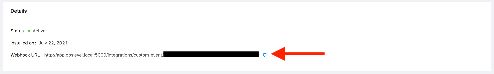

# OpsLevel

## Snyk 및 OpsLevel 통합 소개

OpsLevel을 사용하면 조직의 운영 성숙도를 정의할 수 있습니다. OpsLevel 내에서 Rubrics를 사용하여 성숙한 서비스의 모습에 대한 정의를 만들고 서비스를 평가하여 선호하는 모범 사례에 대한 준수를 측정할 수 있습니다. OpsLevel Checks를 사용하면 서비스가 관심 있는 표준을 충족하는지 확인할 수 있습니다.

Snyk 및 OpsLevel을 사용하여 서비스의 취약점에 대한 검사를 생성할 수 있습니다.

## 작동 방식


**기능 가용성**

이 통합은 Snyk CLI에 의존합니다. [CLI에 대해 자세히 알아보십시오.](../../snyk-cli/guides-for-our-cli/cli-reference.md)


### Snyk 통합 추가

1. OpsLevel 앱의 왼쪽 사이드바에서 **Integrations**을 클릭합니다.
2. **+ New Integration** 버튼을 클릭합니다.
3. **Snyk** 타일을 클릭하여 통합을 추가합니다.

### 검사 생성하기

1.  OpsLevel의 Service Health 메뉴 아래에 있는 **Rubrics** 하위 메뉴로 이동합니다.

    
2. **Custom Event** 검사 만들기
3. **Integration** dropdown에서 생성한 Snyk integration을 선택합니다.
4.  dropdown에서 검사 템플릿 중 하나를 선택합니다.

    

    각 템플릿에 대한 정보는 다음 목록을 참조하십시오:

    1. **No Critical Vulnerabilities**: 패키지 매니페스트 파일에 심각한 취약점이 있는 모든 서비스는 이 검사에 실패합니다.
    2. **No High Vulnerabilities**: 패키지 매니페스트 파일에 높은 취약점이 있는 모든 서비스는 이 검사에 실패합니다.
    3. **Less than 3 Medium Vulnerabilities**: 패키지 매니페스트에 3개 이상의 중간 취약점이 있는 서비스는 이 검사에 실패합니다.
    4. **Less than 5 Low Vulnerabilities**: 패키지 매니페스트 파일에 5개 이상의 낮은 취약점이 있는 서비스는 이 검사에 실패합니다.
    5.  OpsLevel은 검사를 실행할 서비스를 결정하는 데 사용되는 **Service Specifier** 필드와 검사의 통과 또는 실패 여부를 결정하는 데 사용되는 **Success Condition** 필드를 채웁니다. OpsLevel은 검사를 테스트하기 위한 샘플 페이로드도 제공합니다.

        

### `snyk`을 사용하여 OpsLevel에 페이로드 보내기

Snyk CLI를 사용하여 테스트 명령을 실행하고 아래 코드를 사용하여 JSON 출력을 OpsLevel로 다시 보냅니다.

```bash
snyk test --prune-repeated-subdependencies --json |
curl -X POST http://app.opslevel.local:5000/integrations/custom_event/xxxxxxx-xxxx-xxxx-xxxx-xxxxxxxxxxxx \
-H 'content-type: application/json'  --data-binary @-
```

그러면 서비스에 대한 모든 취약점이 이전 섹션에서 생성된 검사가 실행될 OpsLevel로 전송됩니다.


xxxxxxx-xxxx-xxxx-xxxx-xxxxxxxxxxxx 대신 생성한 Snyk Integration의 끝점에 URL을 대체해야 합니다.



