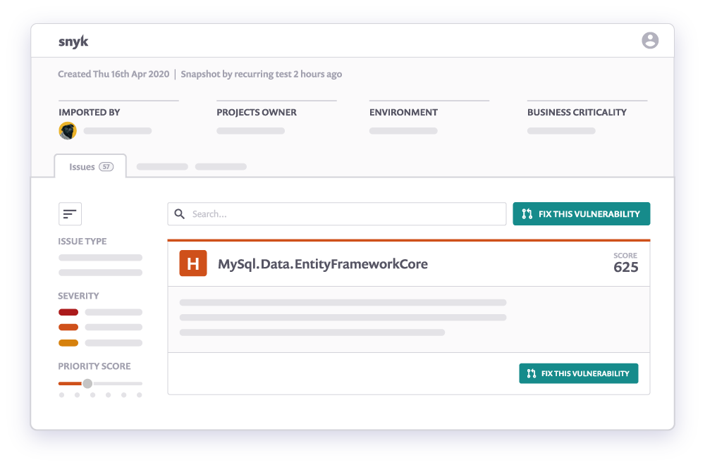

# CLI 시작하기

CLI를 사용하려면 CLI를 설치하고 인증해야 합니다. Snyk CLI 설치 및 Auth 명령 도움말을 참조하십시오. 각 릴리스의 변경 사항에 대한 요약은 릴리스 노트를 참조하십시오.

인증 후 설치를 테스트할 수 있습니다. 디렉토리를 package.json, pom.xml 또는 composer.lock (cd/my/project/)과 같은 지원되는 패키지 매니페스트 파일이 들어 있는 폴더로 변경하고 Snyk 테스트를 실행합니다.

또는 공용 npm 패키지에 대해 빠른 테스트를 수행할 수 있습니다(예: snyk test ionic).

터미널에 있는 테스트 명령 보고서를 보십시오. 이 보고서는 Snyk이 패키지에서 발견한 취약성을 보여줍니다. 발견된 각 문제에 대해 Snyk은 문제의 심각도를 보고하고, 자세한 설명에 대한 링크를 제공하며, 취약한 모듈이 시스템에 진입한 경로를 보고하고, 문제를 해결하는 방법에 대한 지침을 제공합니다.

Snyk CLI를 사용하여 프로젝트의 취약성을 테스트하기 전에 제한된 예외를 제외하고 프로젝트를 빌드해야 합니다(자세한 내용은 Which projects must be built before testing with CLI? 참조). 프로젝트의 언어에 따라 Snyk CLI를 사용하기 전에 언어 환경을 설정해야 할 수 있습니다. 자세한 내용은 Open Source language and package manager support를 참조하십시오.

Snyk CLI를 사용하여 Snyk Code, Container 또는 Infrastructure as Code projects의 문제를 검색하는 경우 각 제품에 관련된 CLI 사용 지침을 참조하십시오.


* CLI를 통한 Snyk 코드 사용하기
* 컨테이너 보안을 위한 Snyk CLI&#x20;
* Snyk CLI for Infrastructure as Code(수정 필요)

## 프로젝트 스

설치 및 인증을 마쳤으면 cd/my/project/를 사용하여 지원되는 패키지 매니페스트 파일(예 : package.json, pom.xml, composer.lock)이 들어 있는 폴더로 디렉토리를 변경합니다. 그런 후 Synk 테스트를 실행합니다. 경로 및 수정 지침을 포함하여 식별된 모든 취약성이 나열됩니다.

예를 들어 snyk container test ubuntu:18.04를 실행하여 Snyk Container가 포함된 태그를 기준으로 Docker image를 검색할 수도 있습니다.

Kubernetes(k8s) 파일을 테스트하려면 snyk iac test /path/to/kubernetes\_file.yaml을 실행합니다.

## 프로젝트 모니터링

Snyk은 프로젝트를 주기적으로 모니터링하고 새로운 취약성에 대해 경고할 수 있습니다. 모니터링할 프로젝트를 설정하려면 Snyk 모니터를 실행하십시오.

이렇게 하면 현재 종속성의 스냅샷이 생성되어 Snyk이 정기적으로 코드를 검색할 수 있습니다. 그런 다음 새로 공개된 취약점이 도입되거나 이전에 사용할 수 없었던 패치 또는 업그레이드 경로가 생성될 때 이를 사용자에게 경고할 수 있습니다. 다음 코드는 Snyk monitor 명령 출력의 예를 보여줍니다.

```
> snyk monitor
Monitoring /project (project-name)...

Explore this snapshot at https://app.snyk.io/org/my-org/project/29361c2c-9005-4692-8df4-88f1c040fa7c/history/e1c994b3-de5d-482b-9281-eab4236c851e

Notifications about newly disclosed issues related to these dependencies will be emailed to you.

```

Snyk Web UI에 로그인하고 프로젝트 페이지로 이동하여 최신 스냅샷 및 검색 결과를 볼 수 있습니다.



자세한 내용은 Monitor your projects at regular intervals을 참조하십시오.

## Running out of tests


## Additional information


## 지

일반적으로 Snyk CLI 또는 Snyk에 대한 도움이 필요할 때마다 Snyk 지원팀에 티켓을 제출하십시오. Snyk 지원은 Snyk 프로젝트에서 GitHub 문제를 적극적으로 모니터링하지 않습니다.

## Contributing(기여)

Snyk CLI 프로젝트는 오픈 소스이지만, Snyk는 외부 기여자를 장려하지 않습니다.

Snyk CLI에 대한 설계 결정 사항을 검토할 수 있습니다.

Snyk CLI 저장소는 모노레포이며 다른 프로젝트와 툴도 다루고 있습니다.

* [@snyk/protect](https://github.com/snyk/cli/tree/master/packages/snyk-protect) ; [npm package for snyk-protext command](https://www.npmjs.com/package/@snyk/protect)

## 보안

보안 문제 또는 관련된 사항 GitHub 저장소의 SECURITY.md 파일을 참조하십시오.
