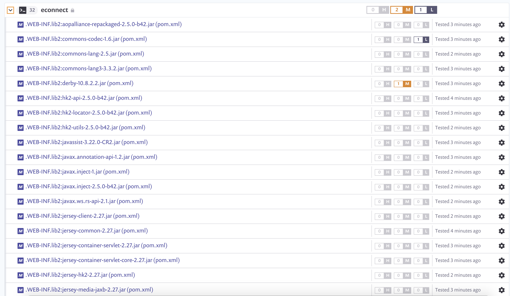

# 관리되지 않는 모든 JAR 파일 검사

Snyk CLI는 [Java applications](https://docs.snyk.io/products/snyk-open-source/language-and-package-manager-support/snyk-for-java-gradle-maven)에서 관리되지 않는 JAR 파일을 검색할 수 있습니다. CLI는 로컬 JAR 파일 해시가 Maven Central JAR 파일 해시와 일치하는 경우에만 패키지 이름, 버전 및 취약성을 식별합니다.

Java 앱은 일반적으로 애플리케이션 내의 여러 위치에 JAR 파일을 가지고 있습니다. 동일한 폴더에 있는 여러 JAR 파일을 검색하는 데 문제가 발생하지 않도록 하려면 개별 JAR 파일을 검색하십시오. 특히 Ant를 사용하는 이전 Java 앱의 경우 더욱 그렇습니다.

**WAR 파일 지원**: 메이븐 센트럴에 게시된 개별 WAR 파일을 검색할 수 있습니다. 오픈 소스 종속성 JAR을 직접 검색하려면 다른 모든 WAR 파일 또는 다른 JAR이 포함된 JAR 파일을 추출(압축 해)해야 합니다.

**필수 구성 요소**: 개별 파일을 검색하려면 **Maven 3.1.0** 이상을 Snyk CLI와 함께 설치해야 하므로 **Maven-dependency-plugin 2.2** 이상이 필요합니다.

메이븐 및 메이븐 종속성 플러그인의 버전을 보려면 `mvn-v`를 실행하십시오.


snyk test --scan-all-unmanaged 명령을 사용하여 단일 폴더의 모든 JAR 파일을 검색하여 Maven central에서 호스팅되는 모든 종속성과 일치시킵니다. Gradle 또는 Maven과 같은 패키지 관리자를 사용하여 응용 프로그램을 만들지 않은 경우 관리되지 않는 모든 파일을 검색하면 종속성 충돌이 발생할 수 있습니다. 이는 특히 Ant를 사용하여 빌드된 응용 프로그램의 경우에 해당됩니다. 따라서 다음 명령을 사용하여 각 JAR 파일을 개별적으로 테스트합니다.\
`snyk test --scan-unmanaged --file=/path/to/file`

또한 각 JAR 파일을 개별적으로 테스트하면 Snyk 웹 UI에서 검색된 JAR 파일의 이름이 표시됩니다. `--scan-all-unmanaged`를 사용하여 검색을 실행하면 파일이 표시되지 않습니다. 응용프로그램의 모든 하위 폴더에서 JAR 파일을 찾고 테스트하려면 간단한 래퍼가 필요합니다. 그런 다음 `snyk test` 에 대한   `--remote-repo-url=AppName` 옵션을 사용하여 Snyk UI에서 결과를 그룹화할 수 있습니다.

다음은 현재 폴더에서 시작하는 모든 하위 폴더를 반복하고 각 개별 JAR 파일을 테스트하는 Linux/Mac BASH 스크립트입니다. **`--remote-repo-url`**의 **PROJECT\_NAME\_HERE**는 중요합니다. UI의 단일 Snyk 프로젝트 아래에 여러 검색 결과를 결합합니다.

`find . -type f -name '*.jar' | uniq | xargs -I {} snyk monitor --file={} --scan-unmanaged --remote-repo-url=PROJECT_NAME_HERE --project-name={}`

음은 scanjar.bat 파일에서 실행되는 윈도우즈 배치 스크립트입니다.

```
REM Usage:    
REM For example: scanjar.bat "C:\workspace\app" "myapp" 
SET workspace=%1 
SET appname=%2 
for /R %workspace% %%f in (*.jar) do cmd /c snyk monitor --scan-unmanaged --remote-repo-url=%appname% --file=%%f
```

다음은 --**remote-repo-url=econnec**t가 있는 앱에 대한 Snyk UI의 최종 결과를 보여줍니다.


The Snyk CLI can scan unmanaged JAR files in [Java applications](https://github.com/snyk/user-docs/blob/5e52535b78618f57eda40eb08fc8fbf91e16f1f0/docs/products/snyk-open-source/language-and-package-manager-support/snyk-for-java-gradle-maven.md). The CLI identifies the package name, version, and vulnerabilities only if the local JAR file hash matches the Maven Central JAR file hash.

Java apps typically have JAR files in a number of locations within an application. To avoid problems from scanning multiple JAR files in the same folder, scan individual JAR files, especially for old Java apps that use Ant.

**WAR file support**: You can scan individual WAR files that are published in Maven Central. To scan open-source dependency JARs directly, you must extract (unzip) all other WAR files or JAR files containing other JARs.

**Prerequisite:** Scanning individual files requires **Maven 3.1.0** or newer to be installed alongside the Snyk CLI, which requires **maven-dependency-plugin 2.2** or higher.

To view the versions of Maven and the maven-dependency-plugin run `mvn -v`.


Use the `snyk test --scan-all-unmanaged` command to scan all JAR files in a single folder to match any dependencies hosted on Maven central. Scanning all unmanaged files may lead to dependency conflicts if an application was not built using a package manager like Gradle or Maven. This is especially true for applications built using Ant.

Therefore test each JAR file individually using `snyk test --scan-unmanaged —file=/path/to/file`. Testing each JAR file individually also has the benefit of showing the name of the JAR file that was scanned on the Snyk web UI; running a scan using --`scan-all-unmanaged` does not show the file. A simple wrapper is required in order to find and test JAR files in all sub-folders of an application. Results can then be grouped in the Snyk UI by using the --`remote-repo-url=AppName` option for `snyk test`.

The following is a Linux/Mac BASH script that iterates through all subfolders starting with the current folder and tests each individual JAR file. The **PROJECT\_NAME\_HERE** in --**remote-repo-url** is important; it combines multiple scan results under a single Snyk project in the UI.

`find . -type f -name '*.jar' | uniq | xargs -I {} snyk monitor --file={} --scan-unmanaged --remote-repo-url=PROJECT_NAME_HERE`

The following is a Windows batch script, run from a **scanjar.bat** file.

```
REM Usage:    
REM For example: scanjar.bat "C:\workspace\app" "myapp" 
SET workspace=%1 
SET appname=%2 
for /R %workspace% %%f in (*.jar) do cmd /c snyk monitor --scan-unmanaged --remote-repo-url=%appname% --file=%%f
```

The following shows the end result in the Snyk UI for an app with the --**remote-repo-url=econnect**


