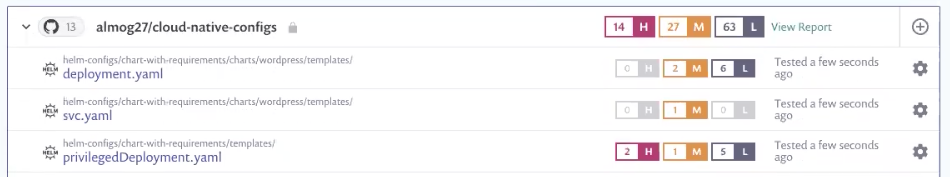
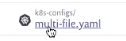

# Snyk Infrastructure as Code (IaC) 시작하기

Snyk IaC를 사용하여 Terraform 또는 Kubernetes(Helm 포함) 환경의 구성 파일에서 issue를 탐색, 검사 및 수정합니다. 자세한 내용은 [Kubernetes 구성 파일 스캔](scan-kubernetes-configuration-files/) 및 [Terraform 파일 스캔](scan-terraform-files/)을 참조하십시오.


이 문서는 Snyk.io UI를 사용하는 프로세스에 대해 설명합니다. Snyk CLI에서 IaC를 사용하는 방법에 대한 자세한 내용은 [해당 문서](snyk-cli-for-infrastructure-as-code/)를 참조하십시오.


## 전제 조건

다음 사항을 확인하십시오.

* Snyk 계정 ([https://snyk.io/](https://snyk.io) 로 이동하여 등록합니다. 자세한 내용은 [Snyk 제품 시작하기](../../getting-started/getting-started-snyk-products/select-snyk-product-tool.md) 참조).
* 기존 Kubernetes 또는 Terraform 환경에서 작업할 수 있습니다.
* 다른 Snyk 제품과 마찬가지로 Git 저장소를 통합합니다. 자세한 내용은 [Git 저장소(SCM) 통합](../../features/integrations/git-repository-scm-integrations/)을 참조하십시오.

## 1 단계: 프로젝트 가져오기

Snyk에서 테스트하고 모니터링할 저장소를 선택하여 Snyk으로 테스트할 프로젝트를 가져옵니다.

1. Snyk.io에서 **Projects**를 선택합니다.
2. 프로젝트를 추가할 도구(예: GitHub)를 선택합니다.
3. **Personal and Organization repositories**에서 사용할 저장소를 선택합니다.
4. 선택한 저장소를 프로젝트로 가져오려면 **Add selected repositories**를 클릭합니다.
5. 진행률 표시줄이 나타납니다. 가져오기 로그 결과를 보려면 **View log**를 클릭하십시오(Kubernetes 및 Terraform 파일을 동시에 검색 가능).
6. 프로젝트 가져오기를 완료했습니다.

## 2단계: 구성 파일 이슈 확인

가져온 프로젝트의 구성 파일에 대한 결과를 확인합니다.

**Projects**를 선택한 다음 가져온 프로젝트 항목을 클릭하여 발견된 심각도 수준별 항목 수를 포함한 스캔한 구성 파일에 대한 정보를 확인합니다.

(이슈는 Helm, Kubernetes 및 Terraform과 같은 프로젝트 유형으로 분류합니다.)

프로젝트를 클릭하면 구성 파일의 이슈에 대한 자세한 정보와 세부 정보를 확인할 수 있습니다.


가져오기 중 오류가 발생하면 [Importing projects](https://support.snyk.io/hc/en-us/sections/360000923478-Importing-projects)를 참조하십시오.


## 3단계: 구성 파일 확인 및 수정

Snyk IaC에서 제공하는 권장 사항에 따라 진행하십시오.

1. IaC 결과는 관련 스캔 구성 파일에서 직접적인 이슈로 나타납니다.
2. 이슈를 클릭하면 해당 이슈에 대한 세부 정보와 Snyk IaC의 권장 사항을 확인할 수 있습니다.
3. 권장 사항에 따라 식별된 이슈를 수정하도록 구성 파일을 편집한 다음 변경 사항을 커밋합니다.
4. Snyk에는 변경된 파일을 자동으로 다시 스캔하고 이슈 디스플레이에 반영된 변경 사항을 확인할 수 있습니다.

## 자세한 내용 확인

자세한 내용은 [Infrastructure as Code](./)를 참조하십시오.
