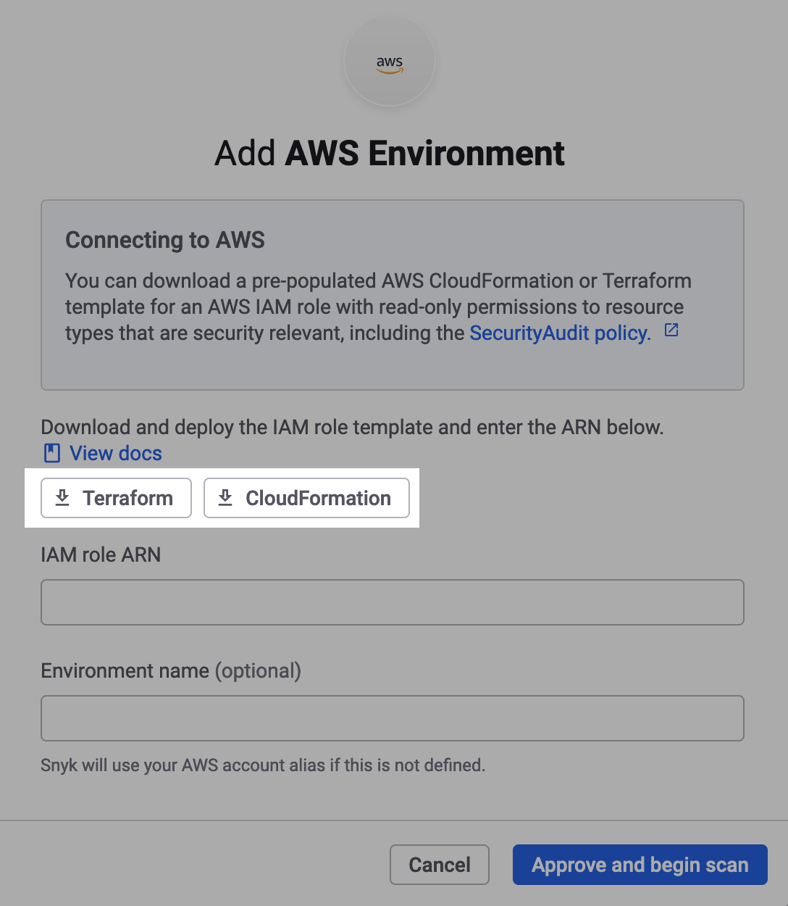

# 1단계: IAM 역할 IaC 템플릿 다운로드 (웹 UI)

Snyk Cloud 환경을 생성하기 전에 Amazon Web Services(AWS) 계정의 리소스 구성을 스캔하기 위해 Snyk이 가정할 수 있는 읽기 전용 **IAM(Identity & Access Management)** 역할을 선언하는 IaC(Infrastructure as Code) 템플릿을 다운로드 해야합니다.

이 IaC 템플릿을 사용하여 [2단계: Snyk IAM 역할 생성](step-2-create-the-snyk-iam-role.md) 에서 역할을 프로비저닝합니다.

[Terraform HCL](https://www.terraform.io/language/syntax/configuration) 또는 [AWS CloudFormation](https://docs.aws.amazon.com/AWSCloudFormation/latest/UserGuide/Welcome.html)의 템플릿 형식을 선택할 수 있습니다. IAM 권한은 동일하므로 작업하기 편한 형식을 선택하십시오.

## IaC 템플릿 다운로드

1. [Snyk 웹 UI](https://app.snyk.io)서 **Integrations > Cloud platforms** 로 이동
2. **AWS** 선택
3. On the **Add AWS Environment** 모델에서, **Terraform** 버튼을 선택하여 `snyk-permissions-aws.tf` 파일을 다운로드하거나 **CloudFormation** 를   선택하여 `snyk-permissions-aws.yml` 파일을 다운로드합니다.

<figure><figcaption>
The Snyk Cloud Add AWS Environment modal
</figcaption></figure>

이제 [2단계:  Snyk IAM 역할 생성C(웹 UI)](step-2-create-the-snyk-iam-role.md) 를 진행할 수 있습니다.


**Organization Settings (톱니바퀴 아이콘) > Cloud environments**. 에서 클라우드 환경을 추가할 수도 있습니다. [Snyk Cloud Environment 보기](../../view-snyk-cloud-environments.md#add-an-environment) 참조하십시오.

