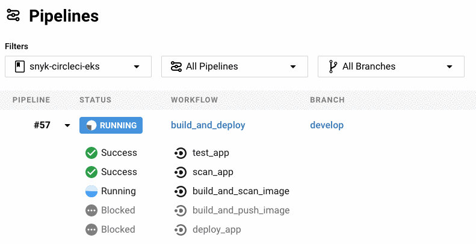

# CircleCI Project

이전 단계를 빠르게 검토해 보겠습니다. 이 중 하나라도 건너뛰거나 놓친 경우 돌아가서 완료했는지 확인하고 싶을 것입니다:

1. 유효한 Snyk, CircleCI 및 AWS 계정
2. 프로비저닝된 Amazon EKS 클러스터
3. GitHub 리포지토리의 `fork` 또는 `clone`

## CircleCI 설정하기

CircleCI를 처음 사용하는 경우 프로젝트 설정에 대한 [단계별 지침](https://circleci.com/docs/2.0/getting-started/#setting-up-circleci)을 검토하는 것이 좋습니다. CircleCI [프로젝트 페이지](https://app.circleci.com/projects/)로 이동하여 Git 저장소에 대해 파이프라인 실행을 자동으로 트리거하도록 구성해야 합니다.

일단 구성되면 후속 `commits` 또는 `pull requests` 가아래 예와 같이 실행을 트리거합니다.

### git push 사용

```bash
git push --force-with-lease origin develop
```

```
Enumerating objects: 9, done.
Counting objects: 100% (9/9), done.
Delta compression using up to 16 threads
Compressing objects: 100% (4/4), done.
Writing objects: 100% (5/5), 1.31 KiB | 1.31 MiB/s, done.
Total 5 (delta 2), reused 0 (delta 0)
remote: Resolving deltas: 100% (2/2), completed with 2 local objects.
To github.com:snyk-partners/snyk-circleci-eks.git
   4a09bea..9025276  develop -> develop
```

### 파이프라인이 트리거됨



### 파이프라인 성공


