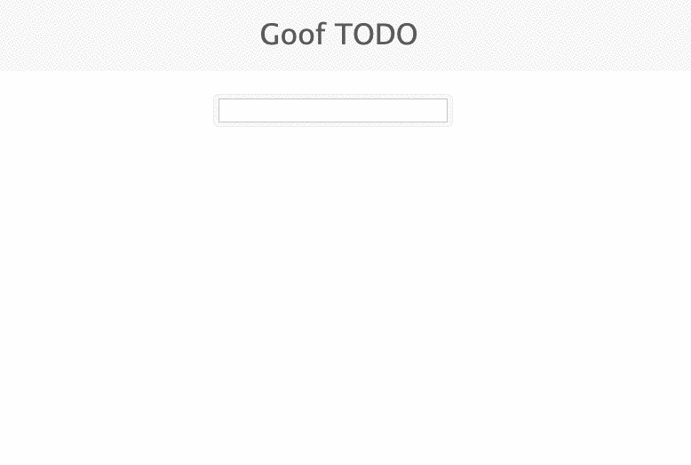
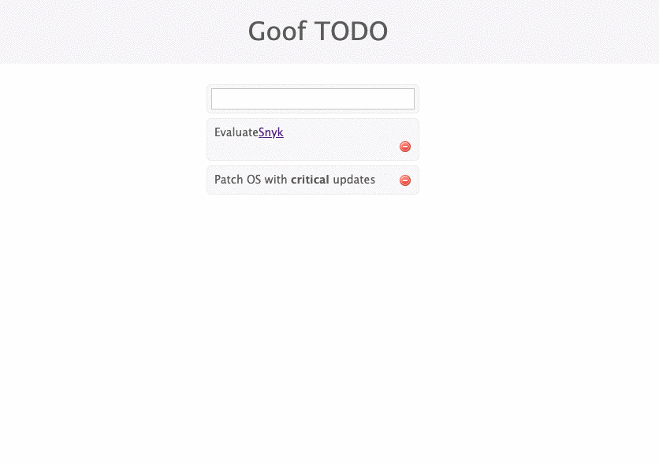

# Example 2

두 번째 예제 취약점은 [`marked`](https://www.npmjs.com/package/marked) [npm](https://www.npmjs.com/) 패키지에 있습니다. 이것은 마크다운을 파싱하기 위한 모듈입니다. 여기서 문제는 우리가 `mark@0.3.5`를 사용하고 있고 여기에는 [XSS(Cross-site Scripting)](https://snyk.io/vuln/npm:marked:20150520) 취약점이 있다는 것입니다.


이것이 샘플 애플리케이션에서 사용되는 방식은 Markdown 입력을 받아 HTML로 변환할 수 있다는 것입니다. 이렇게 하면 굵게 표시하거나 링크를 추가하는 등 **강조**하여 목록에 항목을 추가할 수 있습니다.



그렇다면 취약점은 어디에 있습니까? 다음 예제를 통해 살펴보겠습니다. 목록에 다른 링크를 추가할 예정이지만 이번에는 `javascript`를 포함합니다.

```javascript
[Gotcha](javascript:alert(1))
```

작동하지 않습니다. 따라서 HTML 엔터티로 대체할 수 있습니다. 예를 들어 `:` 는 `&#58;` 및 `)`는 `&#41;`이 됩니다.

```javascript
[Gotcha](javascript&#58;alert(1&#41;)
```

이것도 작동하지 않고 출력이 잘립니다. 따라서 문자열에 `this`를 입력하여 분해합니다. 우리의 `marked` 패키지는 이를 통과시키고 브라우저는 우리의 실수를 용서할 것입니다.

```javascript
[Gotcha](javascript&#58this;alert(1&#41;)
```

결과는 다음과 같습니다:



이제 링크를 클릭하면 `javascript` 경고 팝업이 표시됩니다.


이것은 조잡한 예이지만 훨씬 더 정교한 것이 도입되어 보안을 크게 손상시킬 가능성을 보여줍니다.
